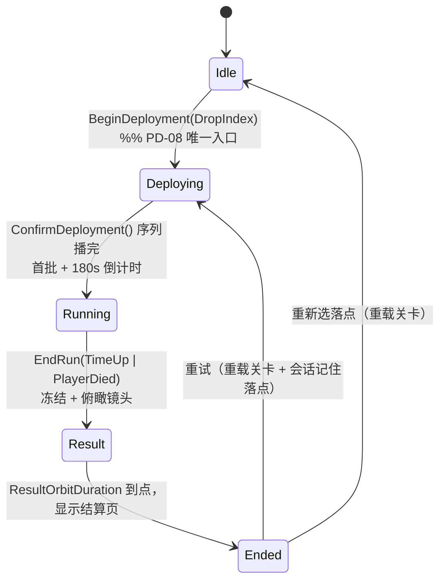

# Phase D 实现计划 —— 整局闭环

> 状态：**代码侧已落地并编译通过**（`SlimeWarEditor Win64 Development`，0 error；自动化测试 11 项全绿）。
> 剩下的全是编辑器资产与 CP-4 实机验收，见 [PhaseD-Checklist.md](PhaseD-Checklist.md)。
> 本文覆盖 v0.1 初步规划，同一目标只保留这一份文件。
> 依据：`Docs/ProgramTaskList.md` §6.5（PD-01~PD-12 / CP-4）+ `Docs/GameDesign/DesignDoc.md` 第二、五、六、七、八章。
> 铁律不变：数值只来自 `DA_RunConfig` / DataTable（铁律 5）；`Core/Flow/UI` 内不出现 GAS 类型（C18）；`IBattleDirector` 是唯一跨模块契约（铁律 6）。
>
> ⚠️ **前置**：Phase C 代码已在工作树完成并编译通过，但**尚未提交**。Phase D 开工前先提交/合并 Phase C，否则地图、`DA_SpawnLayout`、Level Sequence 会与 C 的未提交改动缠在一起。

---

## 0. 摘要

把 Phase C 的「单点位闭环」扩成**一局完整游戏**：准备页选落点 → 投放演出 → 三点位 180s 局内 → 终局 → 结算俯瞰 → 结算页 → 重试。

核对 Phase C 实际代码后，有三处比预想的省：

| 结论 | 证据 |
|---|---|
| **PD-01 几乎零代码** | `URunSubsystem::IssueDueBatches()` 已对全部 `ASpawnPoint` 广播同一批次，"三点同时启动、相同序列"天然成立，只差地图与数据 |
| **PD-02 / PD-03 已有一半** | `EndRun()` 已做停生成 + 锁计分 + 刷新最佳分，代码注释写明"冻结与结算是 Phase D"；`SlimeFlowMath::ShouldRefreshBestScore(TimeUp && Score >= Target)` 已实现并有测试，结算页直接显示即可 |
| **PD-04 大幅缩小** | 重试走关卡重载后不再需要"重置矩阵"；`UScoreSubsystem` 的注释本就写着 "a retry reloads the level" |

本次真正新增：**阶段机、结算冻结、结算数据、4 个 UMG 界面、3 条 Level Sequence、1 张白盒地图**。

---

## 1. 已确认的决策（v1.0 定稿，不再变更）

| # | 决策点 | 结论 | 影响面 |
|---|---|---|---|
| D1 | 运行阶段建模 | **扩展 `ESlimeRunState`**，追加 `Deploying` / `Result` | 单一状态机，仍由 `URunSubsystem` 唯一持有；已确认现有测试不依赖枚举数值 |
| D2 | 重试机制 | **重载关卡**（`OpenLevel`） | 残留问题天然消失；只需跨重载保留"落点 + 重试意图" |
| D3 | UI 技术 | **UMG**（C++ 基类 + WBP 资产） | 准备页与结算页必须响应鼠标 |
| D4 | 结算冻结 | **Flow 主动下发** `ASlimeEnemyBase::SetRunFrozen(bool)` | 相机走正常 tick，无全局副作用；用时间膨胀或引擎暂停会连带影响 Sequencer 与 UI |
| D5 | "首个融合附近" | **扩展 `IBattleDirector::OnEnemyFused` 带位置** | 走 §7.4 契约变更流程，同步 GameMode 委托与 `URunSubsystem` 处理 |
| D6 | 三点位白盒 | **新建 `L_Whitebox_CityPlaza`** | `L_Sandbox_OnePoint` 保留给 CP-3 回归；地图为二进制资产，单人持锁 |
| D7 | 暂停 | **做暂停菜单，沿用已绑定的 P 键**（`IA_Pause`） | 与设计案 3.1 写的"Esc"不符 → 见 §9 偏差登记 |
| D8 | 准备页形态 | **静态俯瞰图 + 手摆标记** | 不被地图完工阻塞 |
| D9 | 演出镜头 | **Level Sequence 资产** | 每个落点一条投放序列 + 共用一条结算序列；时长必须与 DA 对齐（见 §8） |

---

## 2. 范围与依赖

### 2.1 任务表（PD-01 ~ PD-13 + CP-4）

| # | 任务 | Owner | 类型 |
|---|---|---|---|
| PD-01 | 新建三点位白盒地图 + 填 `DA_SpawnLayout` | P1 | 资产为主 |
| PD-02 | 运行阶段机（Deploying / Result）+ 结算冻结下发 | P1 | 代码 |
| PD-03 | `FSlimeRunResult` 结算数据并在 GameState 暴露 | P1 | 代码 |
| PD-04 | 重载关卡重试 + 跨重载会话状态 + 调试命令 | P1 | 代码 |
| PD-05 | 局外准备页（静态俯瞰图 + 信息区） | P2 | 资产 + 代码 |
| PD-06 | 选落点三段交互（点击 → 预览 → 确认） | P2 | 代码 |
| PD-07 | 投放演出 2s + 落地 0.5s 镜头解锁 | P2 | 资产 + 代码 |
| PD-08 | 进入局内的唯一入口 + 关掉自动开局 | P2 | 代码 + 数据 |
| PD-09 | 局内 HUD（分/倒计时/生命/弹匣/点位标记）+ PA-12 图标飞入 | P2 | 资产 + 代码 |
| PD-10 | 结算页（数字 + 重试 / 重新选落点 / 退出） | P2 | 资产 + 代码 |
| PD-11 | 结算俯瞰 2~3s（冻结期间无输入，镜头结束才出结算页） | P2 | 资产 + 代码 |
| PD-12 | 5 条教学提示 | P2 | 代码 |
| **PD-13** | **暂停菜单（P 键）**：继续 / 重试 / 重新选落点 / 退出 | P2 | 资产 + 代码 |
| CP-4 | 整局闭环实机验收 | P1+P2 | 文档 |

> PD-13 为**新增任务**：设计案 3.1 要求暂停，但 `ProgramTaskList.md` 与 PD-01~PD-12 都没有覆盖它。

### 2.2 直接复用的 Phase C 成果（不要重写）

| 已有 | 位置 | Phase D 怎么用 |
|---|---|---|
| `URunSubsystem`：时间轴、批次、终局、5 组委托 | `Public/Flow/RunSubsystem.h` | 扩成阶段机，其余不动 |
| `UScoreSubsystem`（GameInstance）：分数 / 击杀数 / 清空点 / 最佳分 | `Public/Flow/ScoreSubsystem.h` | 结算页直接读；最佳分规则已定 |
| `ASlimeRunGameState`：只读镜像 + 全套 UI 委托 | `Public/Flow/SlimeRunGameState.h` | PD-09 / PD-10 的唯一数据源 |
| `USlimeEnemyManagerSubsystem`：唯一生成入口 + `DespawnAllEnemies` | `Public/Flow/SlimeEnemyManagerSubsystem.h` | 冻结遍历、调试清场 |
| `ASpawnPoint`：锚点即点位、批次、延迟重试、四状态 | `Public/Flow/SpawnPoint.h` | PD-01 只放锚点，数据全在 DA |
| `bAutoStartRun` / `RunDuration` / `TargetScore` / `DeployDuration` / `ResultOrbitDuration` | `USlimeRunConfig` | 四个时长字段已存在且默认为 0；PD-08 只需把自动开局关掉 |
| `ESlimeRunState` / `ERunEndReason` / `ESpawnPointState` | `SlimeWarCoreTypes.h` | D1 只做追加 |
| 12 条 `Slime*` 调试命令 + `Slime.Debug.DrawRun` | `USlimeCheatManager` / `ASlimeHUD` | CP-4 的造场景手段；调试 HUD 保留 |

---

## 3. 架构：运行阶段机

`ESlimeRunState` 扩展为生命周期顺序的五个值；`Idle` **就是准备页阶段**，不再单设 `Preparing`。



| 状态 | 界面 | 倒计时 | 生成 | 玩家输入 | 世界 |
|---|---|---|---|---|---|
| `Idle` | 准备页 | 未启动 | 无 | 锁 | 无敌人 |
| `Deploying` | 投放演出（序列） | 未启动 | 无 | 锁 | 无敌人 |
| `Running` | HUD | 运行 | 按批次 | 可操作 | 正常 |
| `Result` | 无（俯瞰） | 停 | 停 | 锁 | 冻结 |
| `Ended` | 结算页 | 停 | 停 | 锁 | 冻结 |

> **投放阶段为什么不需要"世界暂停"**：设计 5.2 规定首批随玩家获得控制出现，`StartRun()` 之前没有任何敌人。所以只要**不调用 `StartRun()`** 并把玩家输入锁上，"不生成 / 不融合 / 不追踪 / 不伤害"就自动成立。

---

## 4. 关键接口与类型变更

### 4.1 Core（走 §7.4 契约变更流程）

- `ESlimeRunState`：追加 `Deploying`、`Result`（按生命周期顺序插入；现有代码全按名字比较，测试只覆盖纯函数，已确认安全）。
- `IBattleDirector::OnEnemyFused(int32 ResultMass, FVector Location)`：PD-12 需要位置做"附近"判定。

### 4.2 Flow（P1）

- 新增 `FSlimeRunResult { Score, TargetScore, BestScore, NormalKills, ClearedPoints, EndReason, bPassed }`。`bPassed = (EndReason == ERunEndReason::TimeUp && Score >= TargetScore)`——**死亡即失败，即使分数够**（设计 2.5）。放在 `Public/Flow/SlimeRunGameState.h`：只有 UI 消费，不进 Core 冻结层。
- `URunSubsystem` 新增 `BeginDeployment(int32 DropIndex)`（仅 `Idle` 可调用；记录落点并写入会话；切 `Deploying`）、`ConfirmDeployment()`（仅 `Deploying` 可调用；执行现有 `StartRun()` 的开局逻辑，切 `Running`）、`GetSelectedDropIndex()` / `GetRunResult()` / `GetRunPhase()`。
- `EndRun(Reason)`：保留现有"停生成 + 锁计分 + 刷新最佳分"，新增**冻结下发**，切 `Result`，按 `ResultOrbitDuration` 计时后切 `Ended`；幂等守卫改为 `Result || Ended` 直接返回。
- 新增 `USlimeSessionSubsystem : UGameInstanceSubsystem`（跨关卡重载存活）：`SelectedDropIndex`、`bRetryPending`。
- 新增 `URunSubsystem::RequestRetry(bool bReselect)`：写会话标记 → `OpenLevel(GetCurrentLevelName(this, true))`；`OnWorldBeginPlay` 时若 `bRetryPending` 且落点有效，跳过准备页直接 `BeginDeployment`。

### 4.3 Enemy / Player

- `ASlimeEnemyBase::SetRunFrozen(bool)`：停 AIController / StateTree tick、`StopMovementImmediately`、清 `FusionTarget` 配对；恢复时反向。**只用于结算演出**，不参与重试（重试靠重载）。
- `ASlimeWarCharacter` 新增 `SetRunInputBlocked(bool)`（`Idle` / `Deploying` / `Result` / `Ended` 期间禁移动、瞄准与射击）与 `EnterResultState()`（加 `State.Player.Result` + `CancelAbilities`——这就是 **PA-10 的终局半边**，死亡半边 Phase B 已做）。
- `ASlimeWarCharacter::OnPausePressed` 由裸 `PlayerController->SetPause` 改为**广播委托**，让 UI 层订阅；这样 Player（L2）不必反向依赖 UI（L4）。

### 4.4 L1 / UI

- `USlimeGameSettings` 追加 4 个 `TSoftClassPtr<UUserWidget>`：`HUDWidgetClass` / `PreparationWidgetClass` / `ResultWidgetClass` / `PauseWidgetClass`，值写在 `DefaultGame.ini`（沿用"文本配置换资产引用"的做法，不碰资产）。
- 新增 `USlimeUISubsystem : ULocalPlayerSubsystem`：按 `ASlimeRunGameState` 的阶段创建/切换控件、设置输入模式与光标、开关暂停。放在 UI 层是刻意的——只有 L4 才能同时依赖 Flow(L3) 与 Player(L2)，而 Player 绝不能反向引用 UI。
- 新增 4 个 `UUserWidget` 基类：`USlimeHUDWidget` / `USlimePreparationWidget` / `USlimeResultWidget` / `USlimePauseWidget`。
- 新增 `USlimePresentationDirector`：播放 Level Sequence（投放 / 结算），落地后负责 0.5s 混合回玩家视角。

---

## 5. 任务分解

### PD-01 三点位白盒（P1，资产 · C++ 零改动）

1. 新建 `Content/_SlimeWar/Maps/L_Whitebox_CityPlaza.umap`：单层 60×50，三根 `ASpawnPoint` 锚点 A(15,15)、B(45,15)、C(30,38)，`PointId` 分别 1/2/3；主路 4~6 m、环路互通、无跳跃点、墙体/围栏边界（无可坠落边缘）、`NavMeshBoundsVolume` 覆盖全场、每点直径 ≥10 m 空地。
2. `DA_SpawnLayout`：三条 `FSlimeSpawnPointDef`，用生成点编辑器 `Create Default Slots` → `Validate Layout` → `Export To Data Asset`；`DropPoints` 填 D1(8,8)、D2(45,38)。
3. 验收：三点同时收到同一批次（`SlimeRunStatus` 能看到三个点位）。

### PD-02 阶段机与冻结（P1，代码）

1. `SlimeWarCoreTypes.h` 追加两个枚举值。
2. `URunSubsystem` 实现 §4.2 的三个方法，`EndRun` 改为 `Result → Ended`。
3. `EndRun` 内：`TActorIterator<ASlimeEnemyBase>` 逐个 `SetRunFrozen(true)`；玩家 `EnterResultState()`。
4. 守卫：`BeginDeployment` 非 `Idle` 调用、`ConfirmDeployment` 非 `Deploying` 调用 → 打 Error 并拒绝。

### PD-03 结算数据（P1，代码）

1. 定义 `FSlimeRunResult`，`URunSubsystem::GetRunResult()` 组装（最佳分取自 `UScoreSubsystem`）。
2. `ASlimeRunGameState` 转发 `GetRunResult()` / `GetSelectedDropIndex()`，沿用已有 `OnRunEnded` 通知 UI。

### PD-04 重载重试（P1，代码）

1. `USlimeSessionSubsystem`（GameInstance 级，重载不清空）。
2. `RequestRetry(bReselect)` + `OnWorldBeginPlay` 的"跳过准备页"分支。
3. 调试命令 `SlimeRetry`、`SlimeRunDeploy <Index>`。

### PD-05 / PD-06 准备页与选落点（P2）

1. `WBP_SlimePreparation` + `USlimePreparationWidget`：背景静态俯瞰图（`T_Overhead_CityPlaza`）、5 个标记（3 生成点只读、2 落点可点）、信息区（180s / 300 分 / WASD·左键·右键·R·P）。
2. 交互三段：Browse（悬停高亮）→ Preview（点击落点显示预览标记 + 确认按钮）→ Confirm → `BeginDeployment(Index)`。
3. 标记位置在控件里手工摆放，只把 `MarkerIndex ↔ DropPoints[Index]` 对应起来，不做世界→屏幕投影。

### PD-07 投放演出（P2）

1. `LS_Deploy_D1` / `LS_Deploy_D2`（各 2.0 s = `DeployDuration`）。
2. `USlimePresentationDirector` 在阶段变 `Deploying` 时按 `GetSelectedDropIndex()` 选序列播放；序列结束 → `ConfirmDeployment()`，并用 `SetViewTargetWithBlend(玩家 Pawn, 0.5s)` 混回视角（**不阻塞玩法**）。
3. 启动时序列时长与 `DeployDuration` 不符 → 打 Warning。

### PD-08 唯一入口（P2）

1. `DA_RunConfig::bAutoStartRun = false`。
2. 全项目只有 `BeginDeployment` 能进入投放与局内；`SlimeRunStart` 调试命令保留（直接跳 `Running`，供 CP-3 回归）。

### PD-09 HUD 与图标飞入（P2）

1. `WBP_SlimeHUD` + `USlimeHUDWidget`：左上 分 + 300 目标、右上 倒计时、底部 生命 + 弹匣、3 个点位标记（生成中 / 耗尽未清 / 已清空，**不显示精确潜在分数**）。
2. 数据绑定：`ASlimeRunGameState`（分 / 时间 / 点位 / 击杀）+ 玩家 `GetHealthComponent()` / `GetWeaponComponent()` 的既有委托。
3. `USlimeUISubsystem` 负责创建与按阶段切换。
4. **PA-12**：粘液图标从**准星位置**飞入计分 UI（`OnEnemyKilled` 不带位置，本 Phase 不改 C5 契约）。

### PD-10 结算页（P2）

`WBP_SlimeResult` + `USlimeResultWidget`：得分 / 最低目标 / 普通击杀数 / 清空点位数 / 是否过关（+ 最佳分）；三个按钮：重试、重新选落点、退出。

### PD-11 结算俯瞰（P2）

`LS_Result`（2.5 s = `ResultOrbitDuration`）在 `Result` 阶段播放；期间输入全锁、世界冻结；**序列结束（= `Ended`）之后才显示结算页**，否则按钮会压住俯瞰。

### PD-12 教学提示（P2）

| 提示 | 触发 | 数据来源 |
|---|---|---|
| 首次落地：移动与射击 | 进入 `Running` 后首次 | 阶段变化 |
| 首个融合**附近** | 首次融合且距玩家 ≤ `TutorialFusionProximity` | `OnEnemyFused(ResultMass, Location)` |
| 首次换弹：可移动 | `GA_Reload` 首次激活 | Player |
| 达标：可继续冲分 | 分数首次跨过 `TargetScore` | `ASlimeRunGameState::OnScoreChanged` |
| 最后 15 秒 | `RemainingSeconds ≤ 15` 且未提示过 | `OnTimeChanged` |

"只提示一次"的标志放在 HUD 控件内部，随关卡重载自然重建，不进 GameState。

### PD-13 暂停菜单（P2，新增）

1. `WBP_SlimePause` + `USlimePauseWidget`：继续 / 重试 / 重新选落点 / 退出。
2. `ASlimeWarCharacter::OnPausePressed` 改为广播委托；`USlimeUISubsystem` 订阅后 `SetGamePaused(true/false)`。
3. `APlayerController::SetTickableWhenPaused(true)` + `bShouldPerformFullTickWhenPaused = true`，输入模式切 UI-only 并显示光标——**否则暂停菜单的按钮点不动**（当前实现只做了裸 `SetPause`）。
4. 世界计时在暂停时自然停住（timer 受 pause 影响），不需要额外处理。

---

## 6. 内容与配置清单

| 类型 | 路径 | Owner | 说明 |
|---|---|---|---|
| 地图 | `Content/_SlimeWar/Maps/L_Whitebox_CityPlaza.umap` | P1 | PD-01，二进制，单人持锁 |
| 数据 | `Content/_SlimeWar/Core/Data/DA_SpawnLayout.uasset` | P1 | 3 条点位定义 + 2 个落点 |
| 数据 | `Content/_SlimeWar/Core/Data/DA_RunConfig.uasset` | P1 | `bAutoStartRun=false`、`DeployDuration=2`、`ResultOrbitDuration=2.5`、新增 `TutorialFusionProximity` |
| 序列 | `Content/_SlimeWar/UI/Cinematics/LS_Deploy_D1`、`LS_Deploy_D2`、`LS_Result` | P2 | 二进制，与地图同样需要认领 |
| 贴图 | `Content/_SlimeWar/UI/T_Overhead_CityPlaza` | P2 | 准备页静态俯瞰图 |
| 控件 | `Content/_SlimeWar/UI/WBP_SlimeHUD`、`WBP_SlimePreparation`、`WBP_SlimeResult`、`WBP_SlimePause` | P2 | 4 个 WBP，父类为对应 C++ 基类 |
| 配置 | `Config/DefaultGame.ini` | P2 | 4 个 `TSoftClassPtr<UUserWidget>` 路径 |

---

## 7. 测试与验收

### 7.1 自动化（把规则抽成 `SlimeFlowMath` 纯函数再测）

| 测试 | 覆盖 |
|---|---|
| `SlimeWar.Flow.RunPhase` | 合法迁移 `Idle→Deploying→Running→Result→Ended`；重复 `BeginDeployment` / `ConfirmDeployment` / `EndRun` 幂等 |
| `SlimeWar.Flow.RunResult` | `bPassed` 只在"时间到且达标"为真；死亡即使超分也算失败；最佳分刷新沿用现有规则 |
| `SlimeWar.Flow.DropPointSelection` | 落点索引越界与回退 |

现有 8 个测试（`SlimeWar.Flow.*` / `SlimeWar.Spawn.*` / `SlimeWar.Enemy.ActivityArea`）必须保持全绿。

### 7.2 新增调试命令

```text
SlimeRunDeploy <Index>   # 跳过准备页直接投放
SlimeRunResult           # 打印 FSlimeRunResult 全部字段
SlimeRetry               # 走真实的 RequestRetry 路径
SlimePause               # 打开/关闭暂停菜单
```

### 7.3 CP-4 实机清单（完整版见下一份 `Docs/PhaseD/PhaseD-Checklist.md`）

1. 三点同时启动、使用相同序列；
2. 300 分不提前结束；
3. 死亡即失败，且**不刷新**最佳分；
4. 时间到且达标 → 过关并刷新最佳分；
5. 俯瞰 2~3s 内无输入，**结束之后**才出现结算页；
6. **重试 ×3** 无残留（满血满弹、0 分、180s、点位全 `AwaitingDeploy`、无残留敌人）；
7. **重新选落点 ×3** 无残留；
8. 暂停菜单（P 键）可开、按钮可点、重试/重选/退出都通；
9. 5 条教学各只出现一次，不暂停战斗、不抢焦点；
10. 序列时长与 `DeployDuration` / `ResultOrbitDuration` 一致（不一致时日志有 Warning）。

---

## 8. 假设与默认值

- 投放 **2.0 s**（序列时长 = `DeployDuration`），落地后 **0.5 s** `SetViewTargetWithBlend` 混回玩家视角，**不阻塞玩法**（t = 2s 即进入 `Running`）；若策划要求锁定到 2.5s，改一个 DA 值即可。
- 结算俯瞰 **2.5 s**（`ResultOrbitDuration`）。
- Level Sequence 为二进制资产：**每个落点一条投放序列（当前 2 条）+ 共用 1 条结算序列**；序列时长与 DA 不一致时启动打 Warning（DA 值仍是玩法门控的唯一依据）。
- PA-12 图标飞入从**准星位置**出发（`OnEnemyKilled` 不带位置，本 Phase 不改 C5 契约）。
- "退出" = `QuitGame`（PIE 下即停止 PIE）；本作没有主菜单。
- 暂停键沿用已绑定的 **P**（`IA_Pause`，见 `IMC_SlimeWar`），与设计案 3.1 的"Esc"不符 → 见 §9。
- 重试与"重新选落点"都走关卡重载，`USlimeSessionSubsystem` 负责跨重载记住意图；`UScoreSubsystem` 的最佳分本来就是 GameInstance 级，天然跨重试保留。
- 地图、Sequence、WBP、贴图都是二进制资产，GitHub 不支持文件锁 → 按 `Docs/Collaboration.md` 的约定先认领。

---

## 9. 与上级文档的差异（待回填 `Docs/ProgramTaskList.md`）

| # | 差异 | 建议处理 |
|---|---|---|
| 1 | **新增 PD-13 暂停菜单**，任务清单原本没有覆盖 | 在 §6.5 补一行 PD-13 |
| 2 | 契约变更 **C6**：`OnEnemyFused` 追加 `FVector Location` | 更新 §5.1 契约表与变更记录 |
| 3 | 契约变更：`ESlimeRunState` 追加 `Deploying` / `Result` | 更新 §5.1 与变更记录 |
| 4 | **PA-12**（计分 UI 挂钩 + 图标飞入）排在 Phase C，但它依赖 HUD 存在 | 依赖由 `PC-07` 改为 `PD-09` |
| 5 | 设计案 3.1 写"**Esc** 暂停"，实现用已绑定的 **P** | 二选一：改设计案文字，或改 `IMC_SlimeWar` 的按键 |
| 6 | 计划 §3.3 的 Flow/UI 文件名（`SpawnPoint.h` / `RunSubsystem.h`）与现有代码的 `Slime*` 前缀不一致 | 统一成 `Slime*` |
| 7 | PD-04 原文的"清场景痕迹"实际依赖 **PE-01**（Phase E 的喷溅系统） | 在 §6.5 注明 |

---

## 10. 下一步

1. **提交/合并 Phase C**（当前仍是未提交的工作树改动），再动 Phase D 的任何资产。
2. 按 [PhaseD-Checklist.md](PhaseD-Checklist.md) 做编辑器步骤：填 `DA_RunConfig`（**先取消 Auto Start Run**）→ 建白盒地图 → 摆点位并导出 `DA_SpawnLayout` → 做 3 条序列与 4 个 WBP。
3. 按 §9 把差异回填 `Docs/ProgramTaskList.md`（尤其 PD-13 与两处契约变更）。
4. 跑 CP-4 实机验收（Checklist §8 的 12 条）。
