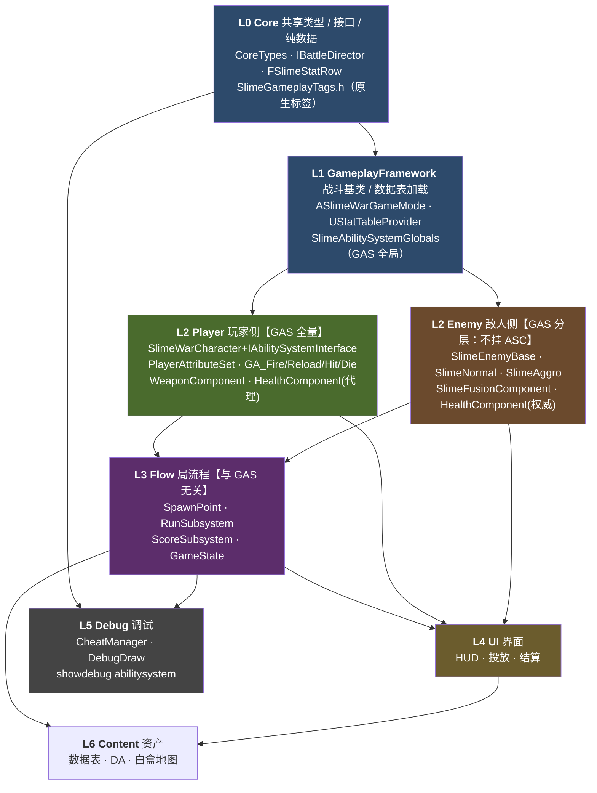
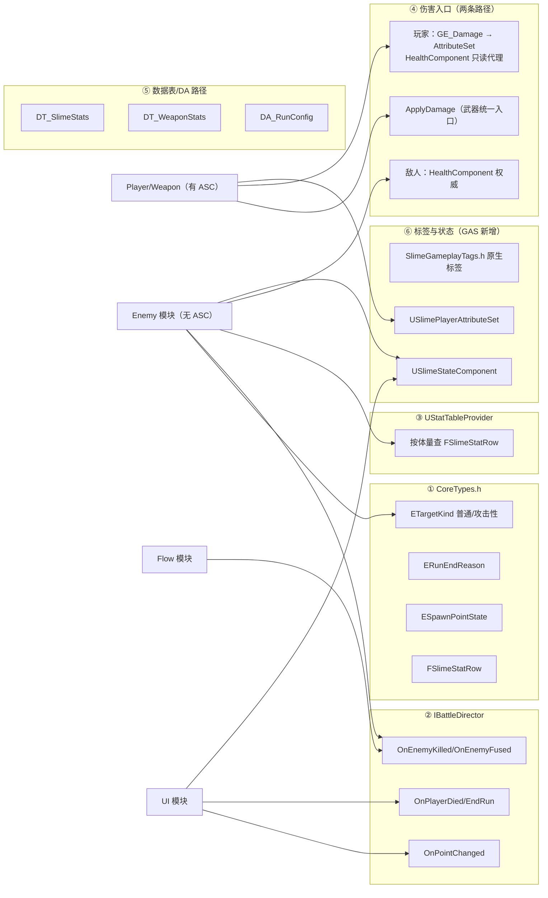

# 程序任务清单与模块框架

> 依据：`策划案/策划案.md`（《粘液城市》Game Jam 策划案）
> 目标：给 2 名远程协作程序一份**不打架**的模块划分 + **先落地**的框架设计 + **可并行**的任务清单
> 约束：本文只做**模块边界、目录结构、接口契约、任务排期、协作规则**；不写具体实现代码，不做数值决策
>
> **已确认的技术决策**（2026 讨论定稿）：
> - **GAS 接入范围 = 分层方案**：**玩家全量 GAS**（ASC + AttributeSet + GA + GE），**敌人不挂 ASC**（走 `HealthComponent` 权威 + 轻量 `StateComponent`）
> - **数值纪律 = 强制**：所有 `GameplayEffect` **只放结构不放数值**，数值一律来自 `DataTable`/`DA`（见铁律 5）
> - **标签 = 原生定义**：`UE_DEFINE_GAMEPLAY_TAG`，**禁止**新建 `DefaultGameplayTags.ini`
> - **`IBattleDirector` 契约不变**：GAS 不得泄漏进 `Public/Core/*`（见铁律 6、C18 红线）

---

## 1. 总览

### 1.1 交付范围（来自策划案第 1.5 节，就这么多，不要扩）

| 系统 | 内容 |
|---|---|
| 玩家 | 单人 TPS 移动 / 瞄准 / 射击 / 换弹 / 生命 |
| 敌人 | 普通史莱姆（融合）、攻击性史莱姆（追击）、批量生成 |
| 局内反馈 | 计分、倒计时、点位状态、终局判定 |
| 关卡 | 单层 60×50 白盒，3 生成点 + 2 落点 |
| 演出 | 投放（2s）→ 局内（180s）→ 结算俯瞰（2~3s） |

**明确不做**：网络同步 / 存档进度 / 货币商店 / 技能树 / 跳跃冲刺翻滚 / 主动技能 / 特殊敌人 / 多关卡。

### 1.2 协作策略（6 条铁律）

1. **先框架，后并行**——Phase 0 由两人一起定完接口再分头开工；接口一旦冻结，改接口必须走"变更流程"（见 §7.4）。
2. **按功能分目录，不按文件类型分**——`Public/Core/`、`Private/Player/`、`Private/Enemy/`。**一个模块的所有文件（类、组件、子系统、UI）全在同一功能文件夹内**。
3. **单向依赖**——只允许依赖"层号更小"的模块；**同层之间用接口/委托通信，禁止互相 include 实现头**。
4. **谁的文件谁改，跨模块只改自己的实现**——需要别人的模块提供能力时，提需求给对方加接口，**不要自己去改对方的 .h**。
5. **【GAS 纪律】数值只准来自 DataTable/DA**——所有 `GameplayEffect` **只放结构**（改哪个属性、加法/乘法、时长、标签、免疫关系）与**表行引用**，**禁止把具体数值写进 GE 资产或蓝图**。
   > 理由：调一个数字若需开编辑器 + 合并 uasset + 走地图锁，2 人远程协作成本立刻翻倍。此规则对 GE 与 GA 蓝图同样强制。
6. **【GAS 纪律】`IBattleDirector` 是唯一对外契约**——引入 GAS 后**不得**在 `Public/Core/` 契约中暴露 `UAbilitySystemComponent` / `FGameplayAttribute` / `FActiveGameplayEffectHandle`。玩家与敌人的承伤路径差异必须被 `USlimeHealthComponent` 隔离掉，**外部只认 `OnDeath` → `IBattleDirector`**。

### 1.3 为什么这样分能减少冲突

| 冲突来源 | 本方案的处理 |
|---|---|
| 两人改同一个 `.h` | 功能分目录，每模块只有 1 个 Public 头（接口），实现细节全在 Private |
| 两人改同一个 `Build.cs` | 由 **P1 独占**，Phase 0 一次性把所有依赖模块加齐 |
| 两人改同一张表 | 按功能建 3 张 DataTable，各自独占 |
| 两人改同一张地图 | **地图锁 + 手递**协议（见 §7.3），或改用关卡实例/DataAsset 承载 |
| 两人改同一套数值 | 数值全走 DataTable/DA，**代码里禁止出现魔法数字**（铁律 5 对 GAS 同样强制） |
| 两人改同一批 GE/GA 蓝图资产 | GE **全部用 C++ 类**（`UGameplayEffect` 子类），蓝图 GE 最多留 0~2 个给策划实验；GA 同理（见 §3.6） |
| 两人抢改 `DefaultGameplayTags.ini` | **标签全部原生定义**（`UE_DEFINE_GAMEPLAY_TAG`），不新建 ini，从源头消除该冲突文件 |
| 编译互相阻塞 | 接口头保持"无实现依赖"（只用前置声明 + UHT 允许的最小 include）；GAS 头只在 `.cpp` 里 include |

---

## 2. 基线（本文写作时已存在）

| 项 | 现状 |
|---|---|
| 引擎版本 | **UE 5.5**（`SlimeWar.uproject` → `EngineAssociation: "5.5"`） |
| 工程位置 | `E:\UE\Unreal Projects\SlimeWar\SlimeWar\` |
| 模块 | 单个 `SlimeWar`（Runtime / Default） |
| 现有源码 | `SlimeWarCharacter`（第三人称模板：SpringArm + Camera + EnhancedInput 的 Move/Look/Jump）、`SlimeWarGameMode`、`SlimeWar.cpp/.h` |
| 现有依赖 | `Core, CoreUObject, Engine, InputCore, EnhancedInput`（**尚未启用 GAS**，需在 Phase 0 增补，见 §4） |
| GAS 现状 | ❌ `GameplayAbilities` 插件未启用；`Build.cs` 无 `GameplayAbilities`/`GameplayTags`/`GameplayTasks` |
| 现有资产 | 第三人称模板（Manny/Quinn、ABP、Prototype 网格材质）、`ThirdPersonMap` |
| 默认地图 / GameMode | `ThirdPersonMap` / `/Script/SlimeWar.SlimeWarGameMode` |
| 版本库 | ❌ **无 `.git`、无 `vcs.md`** —— 2 人远程协作**必须先建仓**（§7.1） |

> 结论：**现有源码是模板，可全部改造**。不会为了"复用"而保留不符合策划案的移动/输入结构。

---

## 3. 框架设计

### 3.1 分层与依赖方向（核心图）



**GAS 的层位（已确认方案：分层）**：
- GAS **不是一层**，而是横切 L1（全局配置）+ L2-Player（全量实现）
- **L3 Flow / L4 UI / L0 Core 内部不得出现任何 GAS 类型**（`UAbilitySystemComponent`、`FGameplayAttribute`、`FGameplayEffectSpec` 等）
- 敌人侧**不挂 ASC**：不为 180 只敌人付 `ASC + AttributeSet` 的代价；敌人状态标签用轻量 `USlimeStateComponent`（见 §3.4 ⑦）

**红色禁区（违反即为返工）**：
- ❌ Enemy → Player 的实现依赖（只允许对 `AActor*`/**接口**的依赖）
- ❌ Player / Enemy → ScoreSubsystem（**只允许通过 `IBattleDirector`**）
- ❌ Core 依赖任何上层（Core 必须零业务依赖）
- ❌ 任何模块 include 另一模块的 `Private/` 头
- ❌ **`Public/Core/*` 出现任何 GAS 类型**（契约必须与实现框架解耦，否则以后换框架要全量返工）
- ❌ **`Public/*` 头文件 include GAS 头**（`AbilitySystemComponent.h` / `GameplayEffect.h` 只在 `.cpp` include，用前置声明）
- ❌ **在 GE 资产/蓝图里写具体数值**（违反铁律 5，直接导致 uasset 冲突）

### 3.2 接口即合同：6 组跨模块契约

这 6 组东西是**两人唯一的共同工作面**，Phase 0 必须一次性定死。



| 契约组 | 提供方 | 使用方 | 冻结时机 |
|---|---|---|---|
| ① `CoreTypes.h` 全部枚举/结构体 | P1 | 两人 | **Phase 0 结束前** |
| ② `IBattleDirector` | P1 声明 / P1 实现 | Enemy + UI | **Phase 0 结束前** |
| ③ `UStatTableProvider` | P1 | Enemy + UI | **Phase 0 结束前** |
| ④ 伤害入口（**两条承伤路径**，见 §3.4 ④） | P2（玩家侧）/ P1（敌人侧） | Weapon → Enemy | **Phase 0 结束前** |
| ⑤ 数据资产路径与字段 | P1 建表 / 双方填 | 两人 | **PA-06 前** |
| ⑥ **标签常量 + `USlimeStateComponent` + `AttributeSet`** | P1（标签/状态）/ P2（属性集） | 两人 | **Phase 0 结束前** |

### 3.3 目录结构（UE 5.5 默认 Public/Private 结构）

```
SlimeWar\Source\SlimeWar\
├── SlimeWar.Build.cs                     ← 【P1 独占】依赖只在这里加
├── SlimeWar.cpp / SlimeWar.h             ← 【P1 独占】仅模块启动
│
├── Public\
│   ├── Core\                             ← 【P1 独占】L0，其他模块只读
│   │   ├── SlimeWarCoreTypes.h           ← 契约①：枚举 + FSlimeStatRow
│   │   ├── BattleDirectorInterface.h     ← 契约②：UINTERFACE
│   │   ├── SlimeWarLog.h                 ← 日志分类
│   │   └── SlimeWarCVars.h               ← CVar 声明
│   ├── GameplayFramework\                ← 【P1 独占】L1
│   │   ├── SlimeWarGameMode.h
│   │   └── StatTableProvider.h           ← 契约③
│   ├── Player\                           ← 【P2 独占】L2
│   │   ├── SlimeWarCharacter.h
│   │   ├── SlimeWarPlayerController.h
│   │   ├── SlimeWeaponComponent.h
│   │   └── SlimeHealthComponent.h
│   ├── Enemy\                            ← 【P1 独占】L2
│   │   ├── SlimeEnemyBase.h
│   │   ├── SlimeNormal.h
│   │   ├── SlimeAggro.h
│   │   └── SlimeFusionComponent.h
│   ├── Flow\                             ← 【P1 独占】L3
│   │   ├── SpawnPoint.h
│   │   ├── RunSubsystem.h
│   │   ├── ScoreSubsystem.h
│   │   └── SlimeRunGameState.h
│   ├── UI\                               ← 【P2 独占】L4
│   │   ├── SlimeHUDWidget.h
│   │   ├── DeploymentWidget.h
│   │   └── ResultWidget.h
│   └── Debug\                            ← 【P1 独占】L5
│       ├── SlimeCheatManager.h
│       └── SlimeDebugDraw.h
│
└── Private\
    ├── Core\                             ← 【P1】
    ├── GameplayFramework\                ← 【P1】
    ├── Player\
    │   ├── Abilities\                    ← 【P2 独占】GAS 能力
    │   │   ├── GA_Fire.cpp/.h
    │   │   ├── GA_Reload.cpp/.h
    │   │   ├── GA_HitProtection.cpp/.h
    │   │   └── GA_Die.cpp/.h
    │   ├── Effects\                      ← 【P2 独占】GE 全部 C++ 类（铁律 5）
    │   │   ├── GE_Damage.cpp/.h
    │   │   ├── GE_FireCooldown.cpp/.h
    │   │   └── GE_Invulnerable.cpp/.h
    │   └── PlayerAttributeSet.cpp/.h
    ├── Enemy\                            ← 【P1】
    ├── Flow\                             ← 【P1】
    ├── UI\                               ← 【P2】
    └── Debug\                            ← 【P1】

SlimeWar\Content\
├── _SlimeWar\
│   ├── Core\Data\                        ← 【P1 建表，双方填】
│   │   ├── DT_SlimeStats.uasset
│   │   ├── DT_WeaponStats.uasset
│   │   ├── DA_RunConfig.uasset
│   │   └── DA_SpawnLayout.uasset
│   ├── Player\                           ← 【P2 独占】
│   │   ├── BP_SlimeWarCharacter.uasset
│   │   └── Input\                        ← IMC / IA（含射击/换弹/暂停）
│   ├── Enemy\                            ← 【P1 独占】
│   ├── Flow\                             ← 【P1 独占】
│   ├── UI\                               ← 【P2 独占】
│   └── Maps\
│       ├── L_Whitebox_CityPlaza.umap     ← 【地图锁】见 §7.3
│       └── L_Sandbox_OnePoint.umap       ← 【P1】单点联调沙盒
└── ThirdPerson\                          ← 【模板保留，不改】
```

> **GAS 资产纪律（铁律 5 的落地形式）**：
> - **GA / GE 首选 C++ 类**，`Content/_SlimeWar/Player/` 下**不建 `Abilities/`、`Effects/` 资产目录**
> - 若策划确实需要在编辑器里试参数，只允许建**至多 2 个**蓝图 GE，命名带 `_EXP` 前缀（`GE_Reload_EXP`），并在文档 §5.4 登记；试完必须把结论落回 DataTable 行
> - **绝不新建 `Config/DefaultGameplayTags.ini`**——标签走 §3.4 ⑦ 的原生定义

### 3.4 类骨架（Phase 0 要写的文件，只列声明意图）

> 说明：以下是**符号级契约**，不是实现。`// TODO` 表示数值/规则来自数据表，代码内**禁止硬编码**。

**① `Public/Core/SlimeWarCoreTypes.h`**

```cpp
UENUM(BlueprintType)
enum class ETargetKind : uint8 { Normal, Aggressive };

UENUM(BlueprintType)
enum class ESpawnPointState : uint8 { AwaitingDeploy, Spawning, DepletedNotCleared, Cleared };

UENUM(BlueprintType)
enum class ERunEndReason : uint8 { None, TimeUp, PlayerDied };

USTRUCT(BlueprintType)
struct FSlimeStatRow : public FTableRowBase
{
    GENERATED_BODY()
    UPROPERTY(EditAnywhere) int32   Mass        = 1;      // 体量 1..8
    UPROPERTY(EditAnywhere) float   MaxHealth   = 0.f;    // 待策划确认
    UPROPERTY(EditAnywhere) float   MoveSpeed   = 0.f;    // 待策划确认
    UPROPERTY(EditAnywhere) float   BodyRadius  = 0.f;    // 待策划确认
    UPROPERTY(EditAnywhere) int32   KillScore   = 0;      // 待策划确认
    UPROPERTY(EditAnywhere) TSoftObjectPtr<UStaticMesh> Mesh;
};
```

**② `Public/Core/BattleDirectorInterface.h`** —— 全局**唯一**的跨模块通信口

```cpp
UINTERFACE(MinimalAPI, BlueprintType)
class UBattleDirector : public UInterface { GENERATED_BODY() };

class IBattleDirector
{
    GENERATED_BODY()
public:
    /** 普通目标死亡 → 按体量计分（唯一计分入口） */
    virtual void OnEnemyKilled(ETargetKind Kind, int32 Mass) = 0;
    /** 融合成功 → 只做统计/表现，不计分 */
    virtual void OnEnemyFused(int32 ResultMass) = 0;
    /** 点位状态变化 → 驱动 HUD 标记 */
    virtual void OnPointStateChanged(int32 PointId, ESpawnPointState NewState) = 0;
    /** 玩家死亡 → 立即终局（任务失败） */
    virtual void OnPlayerDied() = 0;
};
```

配套访问器（放 `GameplayFramework`，避免循环依赖）：

```cpp
// SlimeWarGameMode.h
ASlimeWarGameMode* GetSlimeGameMode(const UObject* WorldContext);  // 内部做 CastChecked + 日志
```

> **设计要点**：Enemy 与 Weapon **完全不认识计分系统**，只认识 `IBattleDirector`。这就是两人能真正并行的原因。

**③ `Public/GameplayFramework/StatTableProvider.h`**

```cpp
UCLASS()
class UStatTableProvider : public UGameInstanceSubsystem
{
    GENERATED_BODY()
public:
    /** 按体量查表；找不到行 → 报错并返回 CDO 默认行（降级策略） */
    UFUNCTION(BlueprintCallable)
    bool GetSlimeStat(int32 Mass, FSlimeStatRow& Out) const;

    UFUNCTION(BlueprintCallable)
    bool GetWeaponStat(FName WeaponId, FWeaponStatRow& Out) const;

protected:
    UPROPERTY(EditDefaultsOnly) TSoftObjectPtr<UDataTable> SlimeStatTable;
    UPROPERTY(EditDefaultsOnly) TSoftObjectPtr<UDataTable> WeaponStatTable;
};
```

**④ 伤害入口（不新建类，用引擎原生）** —— **两条承伤路径（分层方案的核心，见 §3.6）**

```cpp
// 武器：唯一开火入口（不分玩家/敌人，统一走 ApplyDamage）
UGameplayStatics::ApplyDamage(HitActor, WeaponRow.Damage, Controller, this, UDamageType::StaticClass());

// ── 敌人（无 ASC）：HealthComponent 是权威 ──
virtual float TakeDamage(float Damage, FDamageEvent const&, AController*, AActor*) override;
//   → USlimeHealthComponent::ApplyDamage() → 广播 OnHealthChanged / OnDeath

// ── 玩家（有 ASC）：HealthComponent 是 AttributeSet 的【只读代理】──
//   AttributeSet 是权威，HealthComponent 只转发，绝不持有第二份血量
virtual float TakeDamage(...) override;
//   → AbilitySystem->ApplyGameplayEffectToSelf(GE_Damage) → PostGameplayEffectExecute 处理死亡
//   → USlimeHealthComponent 订阅 AttributeSet 的变化并对外广播同一个 OnDeath
```

> **隔离原则**：两条路径的差异**必须全部关在 `USlimeHealthComponent` 内部**。
> 对外（`IBattleDirector` / UI / Flow）**只有一个 `OnDeath`**，外部代码无法也不该知道玩家用了 GAS。

**⑤ 敌人基类**（分层方案下**不挂 ASC**，只挂 `HealthComponent` + 轻量 `StateComponent`）

```cpp
UCLASS(Abstract)
class ASlimeEnemyBase : public ACharacter
{
    GENERATED_BODY()
public:
    virtual float TakeDamage(...) override;
protected:
    UPROPERTY(VisibleAnywhere) TObjectPtr<USlimeHealthComponent> Health;   // ← 权威
    UPROPERTY(VisibleAnywhere) TObjectPtr<USlimeStateComponent>  State;    // ← 状态标签（非 GAS）
    UPROPERTY(EditDefaultsOnly)  ETargetKind TargetKind = ETargetKind::Normal;
    UPROPERTY(EditDefaultsOnly)  int32 Mass = 1;

    UFUNCTION() virtual void HandleDeath();
    /** 死亡：查表 → 通知 Director（Normal 才计分）→ 播喷溅 → 回调池 */
    void NotifyDirectorOnDeath();
    /** 融合后统一重算：查 FSlimeStatRow 应用血量/速度/体型/分值 */
    void ApplyStatRow(int32 NewMass);
};
```

**⑥ GAS 类骨架（玩家侧，P2 独占）**

```cpp
// ── 6.1 全局：Public/GameplayFramework/SlimeAbilitySystemGlobals.h ──
UCLASS()
class USlimeAbilitySystemGlobals : public UAbilitySystemGlobals
{
    GENERATED_BODY()
    // 用途：集中覆写 GAS 全局默认值；并在需要时保证 InitGlobalData 已执行（见 §8 Q10）
};

// ── 6.2 属性集：Private/Player/PlayerAttributeSet.h ──
UCLASS()
class USlimePlayerAttributeSet : public UAttributeSet
{
    GENERATED_BODY()
public:
    // 只放"玩家真正需要"的属性；数值一律由 DataTable 初始化，不写死
    UPROPERTY(BlueprintReadOnly) FGameplayAttributeData Health;         // 初始值来自 DA_RunConfig
    UPROPERTY(BlueprintReadOnly) FGameplayAttributeData MaxHealth;
    UPROPERTY(BlueprintReadOnly) FGameplayAttributeData WeaponDamage;   // 来自 DT_WeaponStats
    UPROPERTY(BlueprintReadOnly) FGameplayAttributeData MagazineSize;
    UPROPERTY(BlueprintReadOnly) FGameplayAttributeData ReloadDuration;
    UPROPERTY(BlueprintReadOnly) FGameplayAttributeData FireRate;
    // ⚠️ MoveSpeed 不进 AttributeSet —— 权威仍在 CharacterMovementComponent

    virtual void PreAttributeChange(const FGameplayAttribute&, float& NewValue) override;          // Clamp
    virtual void PostGameplayEffectExecute(const FGameplayEffectModCallbackData&) override;       // 血归零 → 死亡
    ATTRIBUTE_ACCESSORS(USlimePlayerAttributeSet, Health);
    // ... 其余 ATTRIBUTE_ACCESSORS
};

// ── 6.3 角色接入：Public/Player/SlimeWarCharacter.h ──
UCLASS()
class ASlimeWarCharacter : public ACharacter, public IAbilitySystemInterface
{
    GENERATED_BODY()
public:
    virtual UAbilitySystemComponent* GetAbilitySystemComponent() const override { return AbilitySystem; }
protected:
    UPROPERTY(VisibleAnywhere) TObjectPtr<UAbilitySystemComponent>  AbilitySystem;
    UPROPERTY()                TObjectPtr<USlimePlayerAttributeSet> Attributes;
    UPROPERTY(VisibleAnywhere) TObjectPtr<USlimeHealthComponent>    Health;   // ← 只读代理
    // BeginPlay: InitAbilityActorInfo(this, this)
    //            AbilitySystem->SetReplicationMode(EGameplayEffectReplicationMode::Minimal);  ← 单机
};
```

**⑦ 原生标签：`Public/Core/SlimeGameplayTags.h`（P1 独占，Phase 0 一次性全量定义）**

> 放在 L0，**不依赖 GAS 的 ASC**——敌人也能用 `USlimeStateComponent` 装同一套标签做状态表达与调试。
> **禁止新建 `DefaultGameplayTags.ini`**（那会变成第三个两人争抢的冲突文件）。

```cpp
// 玩家 / 武器状态
UE_DEFINE_GAMEPLAY_TAG(TAG_State_Player_Deploying,       "State.Player.Deploying");
UE_DEFINE_GAMEPLAY_TAG(TAG_State_Player_Controllable,    "State.Player.Controllable");
UE_DEFINE_GAMEPLAY_TAG(TAG_State_Player_Dead,            "State.Player.Dead");
UE_DEFINE_GAMEPLAY_TAG(TAG_State_Player_Result,          "State.Player.Result");
UE_DEFINE_GAMEPLAY_TAG(TAG_State_Weapon_Reloading,       "State.Weapon.Reloading");
UE_DEFINE_GAMEPLAY_TAG(TAG_State_Player_Invulnerable,    "State.Player.Invulnerable");
// 敌人 AI 状态（给 GameplayDebugger / 调试 HUD 用）
UE_DEFINE_GAMEPLAY_TAG(TAG_State_Enemy_Normal_Idle,       "State.Enemy.Normal.Idle");
UE_DEFINE_GAMEPLAY_TAG(TAG_State_Enemy_Normal_Fusing,     "State.Enemy.Normal.Fusing");
UE_DEFINE_GAMEPLAY_TAG(TAG_State_Enemy_Normal_MassLocked, "State.Enemy.Normal.MassLocked");
UE_DEFINE_GAMEPLAY_TAG(TAG_State_Enemy_Aggro_Chasing,     "State.Enemy.Aggro.Chasing");
UE_DEFINE_GAMEPLAY_TAG(TAG_State_Enemy_Aggro_WindingUp,   "State.Enemy.Aggro.WindingUp");
UE_DEFINE_GAMEPLAY_TAG(TAG_State_Enemy_Aggro_Recovering,  "State.Enemy.Aggro.Recovering");
UE_DEFINE_GAMEPLAY_TAG(TAG_State_Enemy_Aggro_Cooling,     "State.Enemy.Aggro.Cooling");
// ── 预留位（本次不实现，但先定义，避免以后改契约）──
// State.Player.Stunned / State.Player.Shielded
// State.Enemy.Debuff.Burning / State.Enemy.Debuff.Slowed
```

**⑧ 轻量状态组件：`Public/Core/SlimeStateComponent.h`（P1 独占，非 GAS）**

```cpp
/** 给"不挂 ASC 的对象"（全部敌人）提供标签状态；也是玩家的统一状态查询口径 */
UCLASS(ClassGroup=(SlimeWar), meta=(BlueprintSpawnableComponent))
class USlimeStateComponent : public UActorComponent
{
    GENERATED_BODY()
public:
    UFUNCTION(BlueprintCallable) void AddStateTag(const FGameplayTag& Tag);
    UFUNCTION(BlueprintCallable) void RemoveStateTag(const FGameplayTag& Tag);
    UFUNCTION(BlueprintCallable) bool HasStateTag(const FGameplayTag& Tag) const;
    /** 供 UI / 调试 HUD / GameplayDebugger 订阅；这是唯一的状态变化出口 */
    DECLARE_DYNAMIC_MULTICAST_DELEGATE_TwoParams(FOnStateTagChanged, FGameplayTag, Tag, bool, bAdded);
    UPROPERTY(BlueprintAssignable) FOnStateTagChanged OnStateTagChanged;
};
```

> **为什么不让敌人也走 `LooseGameplayTag` + ASC**：180 只敌人 × (`ASC` + `AttributeSet`) 只为表达几个状态标签，是纯开销。`USlimeStateComponent` 约 30 行即可，且**对外的 `OnStateTagChanged` 接口与 ASC 一致**，以后若某个敌人真需要状态效果，可以单独把它升级成 ASC，不影响其他敌人。

---

## 4. 模块清单与归属

| # | 模块 | 层 | 归属 | 主要内容 | 依赖 |
|---|---|---|---|---|---|
| M0 | `Core` | L0 | **P1** | 枚举、`FSlimeStatRow`、`IBattleDirector`、日志、CVar、**原生标签 `SlimeGameplayTags`、`USlimeStateComponent`** | 仅引擎 + `GameplayTags` |
| M1 | `GameplayFramework` | L1 | **P1** | `ASlimeWarGameMode`（实现 `IBattleDirector`）、`UStatTableProvider`、**`USlimeAbilitySystemGlobals`** | M0 + `GameplayAbilities` |
| M2 | `Player` | L2 | **P2** | Character（**+`IAbilitySystemInterface`/ASC**）、PlayerController、Weapon、Health（**代理**）、**`USlimePlayerAttributeSet`、4×`GA_*`、3×`GE_*`** | M1 |
| M3 | `Enemy` | L2 | **P1** | `ASlimeEnemyBase`（**不挂 ASC**）、`ASlimeNormal`（融合态机）、`ASlimeAggro`（追打态机）、`USlimeFusionComponent` | M1（**不依赖 GAS 模块**） |
| M4 | `Flow` | L3 | **P1** | `ASpawnPoint`、`URunSubsystem`（计时/终局/批次）、`UScoreSubsystem`、`ASlimeRunGameState` | M2接口、M3接口 |
| M5 | `UI` | L4 | **P2** | HUD（分/倒计时/血/弹匣/点位标记）、Deployment、Result | M4接口 |
| M6 | `Debug` | L5 | **P1** | CheatManager、DebugDraw、CVar 实现、**`showdebug abilitysystem` 接线** | M0/M4 |
| M7 | `Content` | L6 | 分治 | 数据表、蓝图、白盒地图、演出 | — |

**新增引擎侧依赖（全部由 P1 在 Phase 0 一次性加进 `Build.cs`）**

| 模块 | 用途 | 必需 |
|---|---|---|
| `GameplayAbilities` | GAS 本体（ASC / GA / GE / AbilityTask） | ✅ |
| `GameplayTags` | 原生标签（`UE_DEFINE_GAMEPLAY_TAG`） | ✅ |
| `GameplayTasks` | `GameplayAbilities` 的传递依赖，显式列出更稳 | ✅ |
| `GameplayAbilitiesEditor` | 仅编辑器下用 GAS 蓝图节点/资产面板 | 🟡 视需要（放在 `if (Target.bBuildEditor)` 里） |

`SlimeWar.uproject` 需启用插件：
```json
{ "Name": "GameplayAbilities", "Enabled": true }
```

> ⚠️ **`M3 Enemy` 不得依赖 GAS 模块**——保持敌人侧与 GAS 解耦（分层方案的全部意义所在）。若发现敌人侧出现 `AbilitySystemComponent.h` 的 include，即为架构违规。

### 4.1 明确归属边界（避免扯皮）

| 资产/文件 | 唯一 Owner | 另一人怎么做 |
|---|---|---|
| `SlimeWar.Build.cs`、`SlimeWar.h/.cpp` | **P1** | 提需求，不要自己改 |
| `Public/Core/*` 全部 | **P1** | 只读引用；需加接口 → 提需求 |
| `DT_SlimeStats`、`DA_RunConfig`、`DA_SpawnLayout` | **P1** | 只填自己关心的列 |
| `DT_WeaponStats` | **P2** | P1 只读 |
| `Content/_SlimeWar/Player/*`、`UI/*` | **P2** | 不动 |
| `Content/_SlimeWar/Enemy/*`、`Flow/*` | **P1** | 不动 |
| `L_Whitebox_CityPlaza.umap` | **地图锁** | 见 §7.3 |
| `L_Sandbox_OnePoint.umap` | **P1** | P2 只用不改 |
| `Config/DefaultEngine.ini`（默认地图/GameMode） | **P1** | 不动 |
| `Public/Core/SlimeGameplayTags.h`（原生标签） | **P1** | 只读引用；需加标签 → 提需求（走 §7.4） |
| `Public/GameplayFramework/SlimeAbilitySystemGlobals.h` | **P1** | 不动 |
| `Content/_SlimeWar/Player/Abilities/*`、`Effects/*`（若存在） | **P2** | 不动 |
| `Config/DefaultGameplayTags.ini` | **禁止创建** | 标签一律原生定义（铁律 5 配套） |

### 4.2 GAS 分层纪律（方案确认项 Q2=A 的落地）

| 层 | 是否挂 `ASC` | 血量权威 | 状态表达 | 说明 |
|---|---|---|---|---|
| **玩家** | ✅ 挂 | `USlimePlayerAttributeSet` | `LooseGameplayTag` + ASC | GAS 全量：属性、GA、GE、标签 |
| **敌人** | ❌ 不挂 | `USlimeHealthComponent` | `USlimeStateComponent`（轻量） | 不为 180 只敌人付 `ASC+AttributeSet` 代价 |
| **Flow / UI / Core** | ❌ 不涉及 | — | 只读 `OnStateTagChanged` / `IBattleDirector` | 内部**禁止**出现任何 GAS 类型 |

**三条判定规则（自查用）**：
1. 文件里出现 `AbilitySystemComponent.h` 且在 `Enemy/`、`Flow/`、`UI/`、`Core/` 下 → **违规**
2. `Public/Core/*.h` 里出现 `FGameplayAttribute` / `FActiveGameplayEffectHandle` → **违规**
3. 玩家血量的可写入口不在 `AttributeSet`，或敌人血量可写入口不在 `HealthComponent` → **双重权威，违规**

**以后"某个敌人需要状态效果"时的升级路径**（不影响其他敌人）：
> 给该敌人单独加 `IAbilitySystemInterface` + 一个最小的 `USlimeEnemyAttributeSet`，**它对外仍然只通过 `OnDeath` → `IBattleDirector` 上报**——`IBattleDirector` 契约不变，玩家侧代码一行不动。

### 4.3 高风险冲突点 Top 8（重点盯防）

| 排名 | 冲突点 | 风险 | 对策 |
|---|---|---|---|
| 1 | `SlimeWar.Build.cs` | 两人各加一个模块依赖 → 必冲突 | P1 独占，Phase 0 一次性加齐（含 GAS 4 个模块） |
| 2 | `Public/Core/SlimeWarCoreTypes.h` | 两人各加一个枚举成员 → 必冲突 | Phase 0 冻结；变更走 §7.4 流程；P1 独占写权 |
| 3 | `Public/Core/SlimeGameplayTags.h` | 两人各加一个标签 → 必冲突 | 同上；Phase 0 一次性定义**含预留标签** |
| 4 | `Content/_SlimeWar/Maps/L_Whitebox_CityPlaza.umap` | 二进制不可合并 | **地图锁 + 手递**：一次只有一人可开 |
| 5 | `DT_SlimeStats` | 行/列互相覆盖 | 建表时一次性定义全部列；各填各行，禁止新增列 |
| 6 | **GE / GA 蓝图资产** | 若允许蓝图 GE 并存，会出现一批不可合并的数值资产 | **GE/GA 首选 C++ 类**；实验用蓝图 GE 上限 2 个且带 `_EXP` 前缀并登记 |
| 7 | `ASlimeWarGameMode` | 两人都往里加逻辑 | GameMode 只实现 `IBattleDirector` 转发给子系统；逻辑写进各自的 Subsystem |
| 8 | `Config/DefaultEngine.ini` | 默认地图/GameMode 被覆盖 | P1 独占 |

---

## 5. 跨模块接口契约（冻结版）

### 5.1 契约明细表

| # | 契约 | 签名 | 提供 | 消费 | 变更成本 |
|---|---|---|---|---|---|
| C1 | `ETargetKind` | `Normal / Aggressive` | P1 | 双方 | 低 |
| C2 | `ESpawnPointState` | `AwaitingDeploy/Spawning/DepletedNotCleared/Cleared` | P1 | P1, P2(UI) | 低 |
| C3 | `ERunEndReason` | `None/TimeUp/PlayerDied` | P1 | P1, P2(UI) | 低 |
| C4 | `FSlimeStatRow` | `Mass/MaxHealth/MoveSpeed/BodyRadius/KillScore/Mesh` | P1 | 双方 | **高（牵动数值）** |
| C5 | `IBattleDirector::OnEnemyKilled(Kind, Mass)` | 唯一计分入口 | P1 声明 / P1 实现 | M3 | **高** |
| C6 | `IBattleDirector::OnEnemyFused(ResultMass)` | 统计/表现 | P1 | M3 | 中 |
| C7 | `IBattleDirector::OnPointStateChanged(PointId, State)` | HUD 驱动 | P1 | M4→M5 | 中 |
| C8 | `IBattleDirector::OnPlayerDied()` | 立即终局 | P1 | M2 | 中 |
| C9 | `UStatTableProvider::GetSlimeStat(Mass, Out)` | 查表 | P1 | 双方 | 低 |
| C10 | `TakeDamage/ApplyDamage` | 原生 | 引擎 | M2→M3 | 低 |
| C11 | 数据资产路径 | 见 §3.3 | P1 | 双方 | 低 |
| C12 | 委托广播 | `OnHealthChanged/OnDeath/OnAmmoChanged/OnScoreChanged/OnTimeChanged` | 各 Owner | 各 Owner | 中 |
| C13 | 原生标签常量 | `TAG_State_*`（见 §3.4 ⑦） | P1 | 双方 | **中（Phase 0 全量定义含预留）** |
| C14 | `USlimeStateComponent` | `Add/Remove/HasStateTag` + `OnStateTagChanged` | P1 | 双方 | 低 |
| C15 | `USlimePlayerAttributeSet` | 6 个属性 + `PreAttributeChange`/`PostGameplayEffectExecute` | P2 | P2 / UI（只读） | 中 |
| C16 | 玩家承伤路径 | `TakeDamage` → `GE_Damage` → `AttributeSet` → `HealthComponent` 代理广播 | P2 | M2 | **高（分层方案唯一分叉点）** |
| C17 | 4 个能力 + 3 个 GE | `GA_Fire/Reload/HitProtection/Die`、`GE_Damage/FireCooldown/Invulnerable` | P2 | M2 | 中 |
| C18 | **GAS 隔离边界** | `Core/Flow/UI` 不得出现 GAS 类型；`Public/*` 头不得 include GAS 头 | P1 强制审查 | 双方 | **高（架构红线）** |

### 5.2 通信方式约定

| 场景 | 用什么 | 禁止 |
|---|---|---|
| 一个对象通知多个订阅者 | **动态多播委托**（`OnDeath`、`OnScoreChanged`、`OnStateTagChanged`） | 直接互相 Cast 调用 |
| 跨模块的功能请求 | **UINTERFACE**（`IBattleDirector`） | `#include` 对方 Private 头 |
| 每帧需要的状态 | **只读 Getter** | 每帧 `FindComponentByClass` |
| 全局唯一服务 | **UGameInstanceSubsystem / UWorldSubsystem** | 全局单例指针 |
| **GAS 属性读取** | 只读 Getter / `HealthComponent` 代理 | ❗ 外部直接 `SetNumericAttributeBase` 改别人的属性 |
| **GAS 类型出现在公共头** | 前置声明 + `.cpp` 内 include | ❗ `Public/*.h` 里 include `AbilitySystemComponent.h` |

### 5.3 未来扩展如何"不改契约"（上 GAS 要兑现的承诺）

| 未来要加的内容 | 加什么 | **不需要动什么** |
|---|---|---|
| 新史莱姆类型/新敌人 | `DT_SlimeStats` 加行 + `ETargetKind` 加值（或子类） | `IBattleDirector`、玩家侧、Flow |
| 新武器 | `DT_WeaponStats` 加行 + 一个 `GA_*` | 敌人侧、Flow、Core |
| 新技能（玩家主动技） | 一个新 `GA_*` + 必要 `GE_*` | 敌人侧、Flow、Core、`IBattleDirector` |
| 玩家的新状态（眩晕/护盾/易伤） | 一个 `GE_*` + 已在 §3.4⑦ 预留的标签 + 在对应 `GA` 的 `ActivationBlockedTags` 里加一项 | 敌人侧、Flow、Core |
| **某个敌人**需要状态效果 | 单独给该敌人加 `IAbilitySystemInterface` + 最小 `AttributeSet` | **其他敌人、玩家侧、`IBattleDirector`** |
| 新关卡/新点位 | `DA_SpawnLayout` + 地图 | 全部 C++ |
| 新终局条件（主动撤离/全清模式） | `IBattleDirector` 加一个方法（走 §7.4） | 敌人侧、玩家侧 |

> **这张表就是"上 GAS 买到的扩展性"的实际内容**——重点看最后两行：**契约的稳定性来自 `IBattleDirector` 与数据驱动，而不是来自 GAS。** GAS 买到的是"新技能/新状态不用改承伤路径"。

---

## 6. 任务清单

> 规则：**每个任务只属于一个人**（Owner 列）。同一 Phase 内的任务可并行；有依赖的按序号先后。
> 状态列：`[ ]` 未开始 / `[~]` 进行中 / `[x]` 完成 / `[!]` 阻塞

### 6.0 里程碑与检查点

| 里程碑 | 内容 | 集成检查点 | 退出条件 |
|---|---|---|---|
| **Phase 0** | 框架落地：目录、CoreTypes、接口、数据表、空类 | **CP-0 骨架编译** | 两人本地能编译出空框架，数据表能加载 |
| **Phase A** | 玩家枪 + 敌人基类 + 受击/扣血 + 计分主链路 | **CP-1 主链路通** | 玩家能移动射击，史莱姆能死给分，追兵能打到玩家 |
| **Phase B** | 两只普通史莱姆融合 + 追兵攻击态机 | **CP-2 融合通** | 融合不产生击杀分；追兵可被打断，攻击可落空 |
| **Phase C** | 单点位 6 批次循环 + 单点闭环 | **CP-3 单点闭环** | 一个点能跑完 6 批并正确进入"已清空" |
| **Phase D** | 三点 + 180s + 终局 + 结算俯瞰 + HUD | **CP-4 整局闭环** | 一局完整结束，重试不残留状态 |
| **Phase E** | 投放演出、爆裂、融合表现、性能压测 | **CP-5 可提交** | 干净机器能启动并完成一局 |

### 6.1 Phase 0 —— 框架落地（**两人一起，别并行**）

| # | 任务 | Owner | 依赖 | 产出 | 状态 |
|---|---|---|---|---|---|
| FZ-01 | **接口冻结评审**：逐条过 §5.1 的 **C1~C18**，双方签字 | P1+P2 | — | 评审结论 | `[ ]` |
| M0-01 | 建仓库 + 分支规范 + `.gitignore`（含 LFS）+ `vcs.md` | P1 | — | 见 §7.1 | `[ ]` |
| M0-02 | 建立 §3.3 目录骨架（空文件夹 + 迁移模板文件） | P1 | — | 目录 | `[ ]` |
| M0-03 | `SlimeWar.Build.cs` 一次性加齐依赖（**含 `GameplayAbilities`/`GameplayTags`/`GameplayTasks`**）；`uproject` 启用 `GameplayAbilities` 插件 | P1 | M0-02 | Build.cs + uproject | `[ ]` |
| M0-04 | `SlimeWarCoreTypes.h`（C1~C4） | P1 | M0-03 | 头文件 | `[ ]` |
| M0-05 | `BattleDirectorInterface.h`（C5~C8）+ `GetSlimeGameMode` 访问器 | P1 | M0-04 | 头文件 | `[ ]` |
| M0-06 | `SlimeWarLog.h` + `SlimeWarCVars.h`（声明，留空实现） | P1 | M0-03 | 头文件 | `[ ]` |
| M0-07 | `UStatTableProvider` + 3 张 DataTable 的**空表结构**（列名定死） | P1 | M0-04 | 类 + 资产 | `[ ]` |
| M0-08 | `ASlimeWarGameMode` 实现 `IBattleDirector`（空转发） | P1 | M0-05 | 类 | `[ ]` |
| M0-09 | `ASlimeEnemyBase` + `USlimeHealthComponent`（只有承伤/死亡，无 AI） | P1 | M0-05 | 类 | `[ ]` |
| M0-10 | `ASlimeWarCharacter`：删掉 Jump，只留 Move/Look/Camera | P2 | M0-02 | 类 | `[ ]` |
| M0-11 | `USlimeWeaponComponent` 空壳（只有成员与委托声明） | P2 | M0-03 | 类 | `[ ]` |
| M0-12 | `ASlimeWarPlayerController` 空壳 + 拿 Director 的辅助函数 | P2 | M0-05 | 类 | `[ ]` |
| M0-13 | `L_Sandbox_OnePoint.umap` 单点沙盒地图（P2 可直接用） | P1 | M0-09 | 地图 | `[ ]` |
| M0-14 | `USlimeCheatManager` 空壳 | P1 | M0-06 | 类 | `[ ]` |
| M0-15 | **`SlimeGameplayTags.h`：原生标签全量定义（含 §3.4⑦ 的预留位）** | P1 | M0-03 | 头文件 | `[ ]` |
| M0-16 | **`USlimeStateComponent`（轻量状态组件，非 GAS）** | P1 | M0-15 | 类 | `[ ]` |
| M0-17 | **`USlimeAbilitySystemGlobals` + 确认 `InitGlobalData` 时机**（见 §8 Q10） | P1 | M0-03 | 类 | `[ ]` |
| GAS-01 | **`USlimePlayerAttributeSet` 骨架**：6 个属性 + 两个 virtual 覆写（**初始值全部留 0，等 DataTable**） | P2 | M0-17, M0-10 | 类 | `[ ]` |
| GAS-02 | `ASlimeWarCharacter` 接 `IAbilitySystemInterface` + 挂 `ASC` + `InitAbilityActorInfo` + `ReplicationMode::Minimal` | P2 | GAS-01 | 类改造 | `[ ]` |
| GAS-03 | **属性初始化路径**：从 `DA_RunConfig`/`DT_WeaponStats` 读值写入 AttributeSet（**GE 内不含数值，铁律 5**） | P2 | GAS-02, M0-07 | 代码 | `[ ]` |
| GAS-04 | 定义 **3 个 C++ `GE` 类**（`GE_Damage` / `GE_FireCooldown` / `GE_Invulnerable`），**只放结构（属性/运算/时长/标签），不放数字** | P2 | GAS-01 | 3 个类 | `[ ]` |
| GAS-05 | 定义 **4 个 `GA` 类空壳**（Fire/Reload/HitProtection/Die），标注 `ActivationBlockedTags` | P2 | M0-15, GAS-04 | 4 个类 | `[ ]` |
| GAS-06 | **输入→能力映射**：`AbilityLocalInputPressed/Released` + 输入 ID（对齐策划案 3.1 的键位） | P2 | GAS-05 | 代码 | `[ ]` |
| GAS-07 | **`USlimeHealthComponent` 双层实现**：敌人=权威；玩家=AttributeSet 的只读代理，**对外同一个 `OnDeath`** | P2 | GAS-02, M0-09 | 类改造 | `[ ]` |
| **GAS-08** | **架构自查**：确认 `Core/Flow/UI/Enemy` 下无 GAS 类型、`Public/*.h` 无 GAS include（对应 C18 红线） | P1 | 全部 | 检查记录 | `[ ]` |
| **CP-0** | 两人本地编译通过 + 数据表能加载 + 沙盒地图能进 + `showdebug abilitysystem` 能看到玩家属性 | P1+P2 | 全部 | — | `[ ]` |

### 6.2 Phase A —— 主链路（**P1 / P2 完全并行**）

| # | 任务 | Owner | 依赖 | 状态 |
|---|---|---|---|---|
| PA-01 | 移动参数接入数据表（速度/转身/加减速） | P2 | CP-0 | `[ ]` |
| PA-02 | 摄像机：TPS 肩后视角 + 灵敏度配置 | P2 | CP-0 | `[ ]` |
| PA-03 | 输入映射：射击（可按住）/ 辅助瞄准 / 换弹 / 暂停 | P2 | CP-0 | `[ ]` |
| PA-04 | **`GA_Fire` 实现**：LineTrace 即时命中、枪口遮挡判断、击中第一个目标即停；射速由 `GE_FireCooldown` 控制 | P2 | GAS-06, PA-03 | `[ ]` |
| PA-05 | **伤害走 `GE_Damage`**：`GA_Fire` → `ApplyGameplayEffectToTarget`（替代直接 `ApplyDamage`），命中反馈占位（准星/音效钩子） | P2 | PA-04, GAS-04 | `[ ]` |
| PA-06 | **`GA_Reload` 实现**：`AbilityTask_WaitDelay` + 弹匣重填；**换弹期间可移动可瞄准不可射击**；无限备弹 | P2 | GAS-05, GAS-06 | `[ ]` |
| PA-07 | **`GA_HitProtection` 实现**：`GE_Invulnerable`（**0.6s** + `State.Player.Invulnerable`）+ 受伤方向闪示钩子 | P2 | GAS-04, GAS-07 | `[ ]` |
| PA-08 | **玩家状态机（GAS 版）**：投放中/可操作/死亡/结算 用标签 + `ActivationBlockedTags` 表达，替代 enum + switch | P2 | GAS-02, M0-15 | `[ ]` |
| PA-09 | 辅助瞄准（右键）：只做轻微吸附，不加伤害不减速 | P2 | PA-02 | `[ ]` |
| PA-14 | **弹药计数归宿**：弹匣余量由谁持有（AttributeSet 还是 WeaponComponent）**定死一处**，禁止双份 | P2 | PA-06 | `[ ]` |
| PA-15 | 输入阻塞接线：`State.Weapon.Reloading` / `State.Player.Dead` / `State.Player.Result` → 对应 GA 的 `ActivationBlockedTags` | P2 | PA-08 | `[ ]` |
| PB-01 | `ASlimeNormal` 行为态机骨架：生成 → **等待 2s** → 找对象 | P1 | CP-0 | `[ ]` |
| PB-02 | 本点位 6m 活动区约束 + 找不到对象时的**≤3m 游走 + 停 0.5~1.5s** | P1 | PB-01 | `[ ]` |
| PB-03 | 对象筛选：同点位 / 未参与融合 / **体量和 ≤ 8** / 优先最近 | P1 | PB-01 | `[ ]` |
| PB-04 | `ASlimeAggro` 追踪态机：**4.8 m/s** 追玩家 + 遇障碍绕行 | P1 | CP-0 | `[ ]` |
| PB-05 | 攻击态机：**≤1.2m 且无遮挡且冷却完成** → 停移 + 定方向 + **蓄势 0.5s** | P1 | PB-04 | `[ ]` |
| PB-06 | 蓄势结束再判定命中/落空 → **收势 0.35s** → **两次攻击起始间隔 ≥1.6s** | P1 | PB-05 | `[ ]` |
| PB-07 | 攻击伤害走 `ApplyDamage`；**不击退 / 不减速 / 不隔墙 / 不瞬移** 的硬约束自查表 | P1 | PB-06 | `[ ]` |
| PB-08 | 敌人死亡：查表 → `OnEnemyKilled` → 喷溅占位 → 回池（`ApplyStatRow` 复位） | P1 | M0-09 | `[ ]` |
| **CP-1** | 玩家能开枪打死史莱姆并计分；追兵能靠近并打到玩家（扣血+保护生效） | P1+P2 | — | `[ ]` |

### 6.3 Phase B —— 融合与追兵完整（并行）

| # | 任务 | Owner | 依赖 | 状态 |
|---|---|---|---|---|
| PB-09 | `USlimeFusionComponent`：配对请求/接受/拒绝的握手协议 | P1 | PB-03 | `[ ]` |
| PB-10 | 双方**朝彼此之间空地移动**（不穿墙）+ 靠近失败检测 | P1 | PB-09 | `[ ]` |
| PB-11 | **持续接触 0.4s** 判定（双方存活、未分开、条件仍成立），任一失效即取消 | P1 | PB-10 | `[ ]` |
| PB-12 | 融合结算：体量求和 → `ApplyStatRow` → **按剩余生命比例继承** → 新体量按新最大生命换算 | P1 | PB-11 | `[ ]` |
| PB-13 | 融合后 **等待 1s** 才能再融合；**体量 8 锁死为不再融合** | P1 | PB-12 | `[ ]` |
| PB-14 | **融合过程中被杀 → 取消融合，只结算被打死那只一次收益** | P1 | PB-12 | `[ ]` |
| PB-15 | 三只同时接触：只允许两只融合，第三只等待/另找；同一只不能同时参与两次 | P1 | PB-12 | `[ ]` |
| PB-16 | 追兵与普通史莱姆的碰撞关系：可被挡住但需绕行 | P1 | PB-11 | `[ ]` |
| PA-10 | **死亡/终局时 `CancelAbilities`**：取消换弹、禁止射击（对齐策划案"死亡和终局取消换弹"） | P2 | PA-06, PA-08 | `[ ]` |
| PA-11 | **`GA_Die` 实现**：加 `State.Player.Dead` → `CancelAbilities` → `IBattleDirector::OnPlayerDied()` | P2 | GAS-05, PA-08 | `[ ]` |
| PA-16 | **受击保护验证**：`State.Player.Invulnerable` 存在时，后续命中**不扣血**、不误导为连续真实伤害（策划案 4.6.3） | P2 | PA-07 | `[ ]` |
| **CP-2** | 两只史莱姆能稳定融合且**不产生击杀分**；融合中被杀能正确取消；追兵攻击前摇/落空/冷却全对 | P1+P2 | — | `[ ]` |

### 6.4 Phase C —— 生成点与单点闭环

| # | 任务 | Owner | 依赖 | 状态 |
|---|---|---|---|---|
| PC-01 | `ASpawnPoint`：出生位（8 普通位 + 2 攻击位）、活动区、备用位数组 | P1 | CP-2 | `[ ]` |
| PC-02 | 批次逻辑：**0/20/40/60/80/100s，共 6 批，每批 8 普通 + 2 攻击** | P1 | PC-01 | `[ ]` |
| PC-03 | 出生点校验：可站立 且 **距玩家 ≥3m** → 否则备用位 → **最多延迟 2s** → 否则取消该只（**不补发**） | P1 | PC-02 | `[ ]` |
| PC-04 | 后续批次**提前 1s 提示**（形式待定 → 先出委托，UI 再挂） | P1 | PC-02 | `[ ]` |
| PC-05 | 点位四状态机：`等待投放→生成中→耗尽未清→已清空`；**清空判定只看普通目标，不含存活追兵** | P1 | PC-02 | `[ ]` |
| PC-06 | `URunSubsystem`：开局启动三点、**180s 倒计时**、驱动批次 | P1 | PC-02 | `[ ]` |
| PC-07 | `UScoreSubsystem`：按体量计分、总分、最佳分（失败成绩**不刷新最佳分**） | P1 | M0-05 | `[ ]` |
| PC-08 | 敌人对象池：**峰值 180 只**，回池时 `ApplyStatRow` 还原到 CDO 参数 | P1 | PB-08 | `[ ]` |
| PC-09 | `ASlimeRunGameState`：把分数/时间/点位状态暴露成只读状态 | P1 | PC-06 | `[ ]` |
| PA-12 | 计分 UI 挂钩 + 粘液图标飞入动画（纯表现） | P2 | PC-07 | `[ ]` |
| PA-13 | 交互式调试 HUD：显示当前体量/生命/状态（进 P1 的 Debug） | P2 | PC-09 | `[ ]` |
| **CP-3** | 单点跑完 6 批，正确进入"已清空"；总分与手算一致 | P1+P2 | — | `[ ]` |

### 6.5 Phase D —— 整局闭环

| # | 任务 | Owner | 依赖 | 状态 |
|---|---|---|---|---|
| PD-01 | 扩到 **3 个点位**，同时启动，使用**相同序列** | P1 | CP-3 | `[ ]` |
| PD-02 | 终局判定：**只有 生命耗尽 / 倒计时结束** 两种；达 300 分不提前结束 | P1 | PC-06 | `[ ]` |
| PD-03 | 结算数据：得分 / 最低目标 / 普通击杀数 / 清空点位数 / 是否过关 | P1 | PD-02 | `[ ]` |
| PD-04 | **重试"不残留状态"**：清池、清计分、复位计时、复位点位、清场景痕迹 | P1 | PD-03 | `[ ]` |
| PD-05 | 局外准备页：单关卡信息（180s / 300 分 / 操作说明）+ 静态俯瞰图 | P2 | PD-01 | `[ ]` |
| PD-06 | 选落点流程：点击 → 预览标记 → 再点确认（D1/D2 + 三个生成点标记） | P2 | PD-05 | `[ ]` |
| PD-07 | 投放演出 **2s** + 落地 **0.5s** 镜头解锁；**演出期间世界暂停**（不生成/不融合/不追踪/不伤害） | P2 | PD-06 | `[ ]` |
| PD-08 | 进入局内的唯一入口：发放控制权 → 启动倒计时 → 激活所有点位与首批 | P2 | PD-07 | `[ ]` |
| PD-09 | HUD：左上计分+300 目标 / 右上倒计时 / 底部生命+弹匣 / 点位状态标记 | P2 | PC-09 | `[ ]` |
| PD-10 | 结算页：数字 + 重试 / 重新选落点 / 退出 | P2 | PD-03 | `[ ]` |
| PD-11 | **结算俯瞰镜头 2~3s**（敌人与玩家定住），展示喷溅痕迹 | P2 | PD-10 | `[ ]` |
| PD-12 | 提示与教学：首次落地、首个融合附近、首次换弹、达标提示、最后 15 秒 | P2 | PD-09 | `[ ]` |
| **CP-4** | 一局从选点到结算完整跑通；连续重试 3 次状态无残留 | P1+P2 | — | `[ ]` |

### 6.6 Phase E —— 表现与提交

| # | 任务 | Owner | 依赖 | 状态 |
|---|---|---|---|---|
| PE-01 | 命中/死亡喷溅、场景染色、痕迹保留与**超量后最早淡出** | P2 | CP-4 | `[ ]` |
| PE-02 | 融合表现：体积/材质/轮廓变化，**形状+色彩双重区分**普通与攻击性 | P1 | CP-4 | `[ ]` |
| PE-03 | 攻击前摇的音画提示**先于伤害**，不被爆裂盖住 | P1 | CP-4 | `[ ]` |
| PE-04 | 受伤反馈：方向闪示不改变瞄准中心、镜头轻震不长期锁定 | P2 | CP-4 | `[ ]` |
| PE-05 | **性能压测：不打不融、全场峰值 180 只** 下的帧率与内存 | P1 | PC-08 | `[ ]` |
| PE-06 | 打包验证：干净环境/新机器能启动并完成一局 | P1 | PE-05 | `[ ]` |
| PE-07 | 数值易调性验收：所有数值均可**不改代码**调整 | P1 | CP-4 | `[ ]` |

### 6.7 任务量分布（用于判断是否失衡）

| | P1（敌人/流程侧） | P2（玩家/UI侧） |
|---|---|---|
| Phase 0 | 15 项（M0-01~17 + GAS-08） | 10 项（M0-10~12 + GAS-01~07） |
| Phase A | 8 项 | 11 项 |
| Phase B | 8 项 | 3 项 |
| Phase C | 9 项 | 2 项 |
| Phase D | 4 项 | 8 项 |
| Phase E | 3 项 | 3 项 |
| **合计** | **47 项** | **37 项** |

> **P2 的增量主要来自 GAS（Phase 0 的 `GAS-01`~`GAS-07` 共 7 项）**——这是分层方案的代价集中处（玩家侧吃下全部 GAS 复杂度，敌人侧不受影响）。
> 因此 **Phase 0 的推荐分工是**：P1 铺接口/标签/GAS 全局，P2 啃 AttributeSet + Character 接入 + 三个 GE 骨架。
> **Phase 0 两人都不空转**，且地图（`L_Whitebox_CityPlaza`）此时仍无人碰，避免地图锁冲突。
> 代价估计：**GAS 增量约 +1 天**（相对于纯手写方案）。

---

## 7. 协作规则（远程 / 2 人）

### 7.1 版本库（**已作废，以 `Docs/Collaboration.md` 为准**）

> ⚠️ **2026-10-04 修订**：仓库、LFS、分支与协作规则均已落地，唯一权威是 `Docs/Collaboration.md`。
> 本节以下内容仅作历史参考，**不要再按它执行**（尤其是下面的 `dev` 分支与 `vcs.md`，实际不使用）。
> 另外新增一条硬约束：**仓库内路径必须 ASCII**（中文名/空格会让 UBT 崩溃），见 `Docs/Collaboration.md` §8。

当前工程**没有版本库**，2 人远程协作不建仓等于自杀。建议：

```
主干:      main          —— 只接受通过 CP 检查点的合并
开发:      dev           —— 日常集成
功能:      feat/<模块>-<任务号>   例: feat/enemy-PB-09
热修:      fix/<问题>
```

`vcs.md` 内容建议（模板）：

```markdown
# 版本库信息
- 远端: <git remote url>
- 主干: main / 集成分支: dev
- 分支命名: feat/<模块>-<任务号>
- 提交信息: [<任务号>] <一句话>   例: [PB-12] 实现融合体生命比例继承
- 大文件: 已启用 Git LFS（*.uasset *.umap *.ubulk）
- 地图锁: 见 .dsh/plan/程序任务清单与模块框架.md §7.3
```

> ⚠️ UE 项目**必须上 Git LFS**，否则 `.uasset`/`.umap` 会让仓库爆炸。
> ⚠️ 提交前必须**关闭编辑器**（`.uasset` 独占写锁），并确保 `.gitignore` 排除 `Binaries/ Intermediate/ Saved/ DerivedDataCache/`。

### 7.2 每日节奏

| 时间 | 动作 |
|---|---|
| 开工 | 拉 `dev`，`git merge dev` 到自己的 `feat/*` |
| 每完成一个任务 | 提交一次（粒度 = 任务号），推送 |
| 每日至少 1 次 | 合到 `dev`（**不要攒超过 1 天**） |
| 每次合并前 | 本地**编译 + 进沙盒地图跑一次** |
| 每周 | 过一次"接口是否需要变更"（见 §7.4） |

### 7.3 地图锁（二进制资产唯一解法）

`.umap` / `.uasset` **无法合并**，两人同时改等于一人白干。协议：

1. 打开地图前，在 `vcs.md`（或专用 `map-lock.md`）里写：`L_Whitebox_CityPlaza —— 锁定人: P2 —— 时间: <ts>`
2. 只有锁定人能编辑，编辑完提交并**清除锁定行**
3. 另一人**只进编辑器看，不保存**
4. 每日最多交接 1 次
5. **P2 建议改为"数据驱动布点"**：生成点/落点用 `DA_SpawnLayout`（普通 uasset，冲突面小）记录，地图里只放锚点 → 大幅减少地图编辑次数，把地图锁的使用压到最低

### 7.4 接口变更流程（保护"先框架后并行"）

```
1. 提出方在聊天里发：任务号 + 想加/改的接口签名 + 理由
2. P1（Core 所有者）确认，必要时同步给对方
3. P1 在 feat/core-<号> 分支改 Public/Core/*，单独一个提交，先合 dev
4. 双方拉新 dev，各自适配
5. 若影响已完成任务 → 记入 §8 待办
```

**禁止**：不打招呼直接在对方模块里加函数；直接改 `Public/Core/*`。

### 7.5 责任人不存在时的兜底

| 情况 | 处理 |
|---|---|
| 对方模块阻塞自己 | 先按**接口签名**写调用方代码 + `// TODO(对方):` 注释，用桩函数/假数据继续，不要等 |
| 必须等对方 | 立刻切到自己任务清单里的**下一个无依赖任务**（每 Phase 都留了双线任务） |
| 数值未定 | 全部走 DataTable，表里先填 **占位值 + `// PLACEHOLDER` 标记**，绝不在代码里写死 |

---

## 8. 待确认事项（阻塞数值，不阻塞框架）

> 这些**不阻塞 Phase 0**（框架不写数值），但**阻塞 Phase A/B 的验收**。来源：`策划案/策划案.md` 第 4.5 节整节缺失。

| # | 待确认 | 阻塞 | 建议默认值（占位） |
|---|---|---|---|
| Q1 | **体量表**：体量 1~8 的 `生命/速度/体积/分值` | PA/PB 全部验收 | `生命=20×体量`、`分值=10×体量`（**PLACEHOLDER，须策划确认**） |
| Q2 | 玩家最大生命 | PA-07 | 100 |
| Q3 | 玩家移动速度 | PA-01 | 6 m/s（7.1 节逆推） |
| Q4 | 弹匣容量 / 换弹时长 / 射速 | PA-06 | 8 发 / 1.0s / 10 发每秒（由"252 发 / 31 次换弹"逆推） |
| Q5 | 每发伤害 | PA-04 | 20（体量 1 一发死 + 追兵 3 发死 逆推） |
| Q6 | 攻击性个体生命 | PB-04 | 60（"36 只满血追兵需 108 次命中"逆推） |
| Q7 | 体量对应的**视觉/碰撞尺寸** | PB-08 | 体量 1 直径 0.4m，体量 8 直径 1.2m（图注仅给最大值） |
| Q8 | "后续批次提前 1 秒提示"的形式 | PC-04 | 先出委托，UI 后挂 |
| Q9 | 第 8 章表现 / 8.5 资源清单 / 9.2 分工 | PE 全部 | 文档"待填"，需 @咩 补齐 |
| Q10 | **`UAbilitySystemGlobals::InitGlobalData()` 在你们 UE 5.5 分支的调用时机**（是否已随模块自动执行） | GAS-03 | 先按"自动"实现；若出现 TargetData/标签异常，再在 `USlimeAbilitySystemGlobals` 里显式调用。**需按实际引擎源码核对一次** |
| Q11 | 玩家弹匣余量的**唯一归属**（AttributeSet `MagazineAmmo` 还是 `USlimeWeaponComponent`） | PA-14 | 建议：**AttributeSet 只存"容量/换弹时长"等配置值；"当前余弹"放 `WeaponComponent`**（每帧变化的临时状态不宜进 AttributeSet） |
| Q12 | 实验用蓝图 GE 是否需要（铁律 5 的例外额度） | GAS-04 | 默认 **0 个**；策划确需试参数时才开，且上限 2 个并登记 |

> ⚠️ **GAS 方案带来的额外待办（不是缺陷，是选择代价）**：玩家与敌人从此有**两条承伤路径**。
> 若最终发现不需要 GAS 的扩展收益，回退成本 = 删除玩家侧 `ASC`/`AttributeSet`/`GA`/`GE`，把玩家承伤改回 `HealthComponent` 权威——**因为对外只有 `OnDeath` → `IBattleDirector`，回退不会波及敌人侧与 Flow/UI**。这是分层方案刻意保留的"可退路"。

> ⚠️ **另有一条设计层风险**（影响 PB-12 的实现语义，需策划确认）：按 `生命=20×体量` 与"融合后按剩余比例继承"，融合会**增加全场总生命池**（两只体量 1 共 40 血 → 合体体量 2 为 40…若生命非线性则更多）。这直接决定"等待融合"是否成立。**实现上必须让这条规则完全数据驱动**，以便策划快速试数。

---

## 9. 文档规则

- 本文是**程序侧计划**，不替代策划案；**任何规则变更以策划案为源**，本文只记"怎么分工、怎么落地"。
- 任务状态在 §6 表格里就地更新（`[ ] / [~] / [x] / [!]`），不要另建进度文档。
- 接口变更记入 §7.4 流程，并在 §5.1 表格中更新"变更成本"。

---

## 10. 参考文档

| 文档 | 路径 | 用途 |
|---|---|---|
| 策划案 | `策划案/策划案.md` | 规则与体验的唯一来源 |
| 整局流程图 | `策划案/图片和附件/image 3.png` | 局外→投放→局内→结算 |
| 局内决策循环 | `策划案/图片和附件/image 1.png` | 收益/生存/位置三分支 |
| 敌人行为逻辑 | `策划案/图片和附件/image 2.png` | **含全部 AI 数值，实现的主要依据** |
| 刷新点刷怪逻辑 | `策划案/图片和附件/image.png` | 批次/时序/上限 |
| 白盒示意图 | `策划案/图片和附件/image 4.png` | 坐标、距离、活动范围 |

---

## 11. 变更记录

- `YYYY-MM-DD HH:mm`：初始创建
  > 时间戳待补：本机子进程/沙箱不可用（`SetNamedSecurityInfoW` 失败），无法读取系统时间。请在首次提交时填上真实时间。
- `YYYY-MM-DD HH:mm`：**接入 GAS（分层方案）**。变更范围：
  - §1 头部新增"已确认的技术决策"；§1.2 铁律 4 条 → **6 条**（新增 GAS 数值纪律、`IBattleDirector` 隔离纪律）
  - §1.3 冲突表新增 GE/GA 资产、`DefaultGameplayTags.ini`、GAS 头隔离三行
  - §2 基线补充 GAS 现状（插件未启用）
  - §3.1 分层图补 GAS 层位（玩家全量 / 敌人不挂 ASC）+ 新增 3 条红色禁区
  - §3.3 目录结构新增 `Private/Player/Abilities|Effects`、`PlayerAttributeSet`
  - §3.4 ④ 伤害入口拆成两条承伤路径；⑤ 敌人基类改为不挂 ASC；**新增 ⑥ GAS 类骨架、⑦ 原生标签、⑧ `USlimeStateComponent`**
  - §4 模块表新增 GAS 内容与依赖清单；**§4.2 新增"GAS 分层纪律"**；§4.3 高风险冲突点 Top 6 → **Top 8**
  - §5.1 契约 C1~C12 → **C1~C18**；§5.2 新增 GAS 通信约定；**§5.3 新增"未来扩展不改契约"对照表**
  - §6.1 新增 `M0-15~17` 与 **`GAS-01~GAS-08`**；§6.2 `PA-04~PA-08` 改为 GAS 实现口径，新增 `PA-14~PA-16`；§6.3 `PA-10/PA-11` 改为 GAS 口径
  - §6.7 任务量重算（P1 47 项 / P2 37 项）；§8 新增 `Q10~Q12` 与"可回退性"说明
