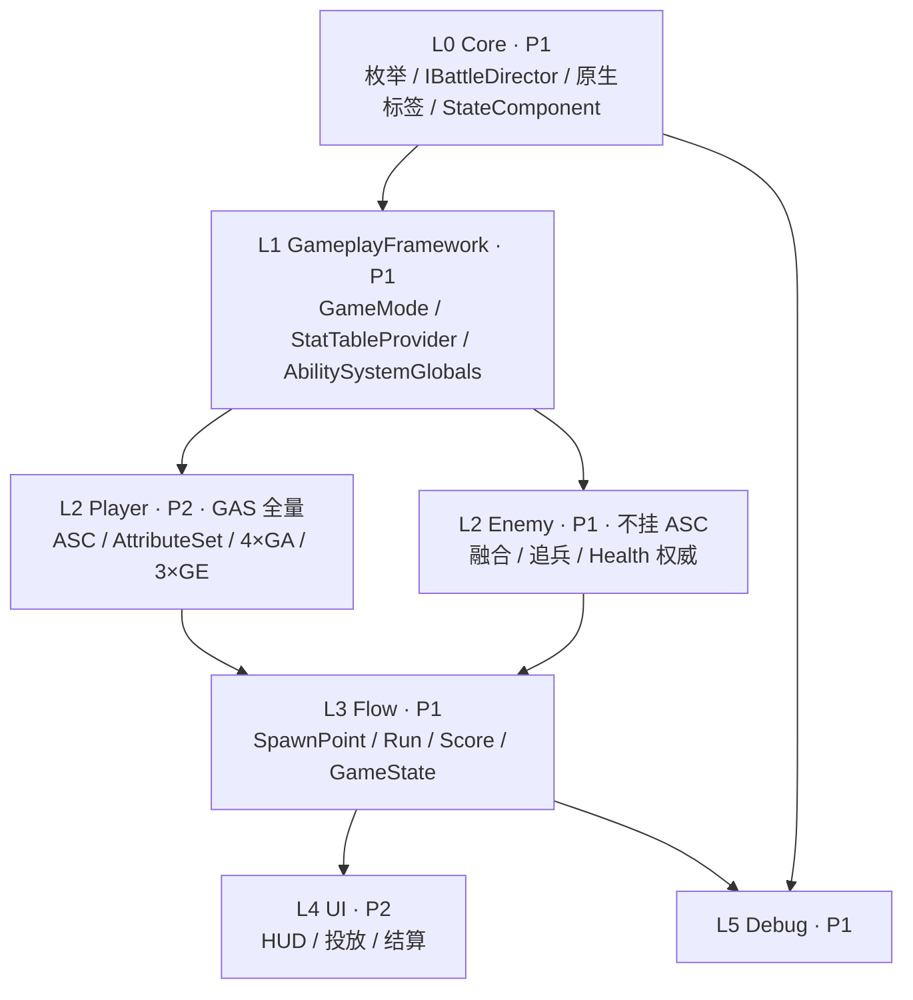

# SlimeWar（粘液城市）· 工程 README

> 一句话：UE 5.5 单机 TPS Game Jam 项目——玩家拿枪打史莱姆，史莱姆会两两融合变大变强，
> 180 秒内在 3 个生成点上刷分。**无网络、无存档、无商店、无技能树**。
>
> 本文定位：**工程计划导读 + 仓库现状核对 + 问题清单 + Phase 0 实施状态**。
> 计划正文已随 Phase 0 一起入库：`Docs/ProgramTaskList.md`（原先在仓库外，见 §10）。

---

## 0. 30 秒速览

| 项 | 值 |
|---|---|
| 引擎 | UE **5.5**（`SlimeWar.uproject` → `EngineAssociation: "5.5"`） |
| 仓库根 | `SlimeWar\SlimeWar\`（注意：`策划案\` 和 `.dsh\plan\` 在它的**上一层**） |
| 远端 | GitHub `GoGoGo-TapTap/SlimeWar`；当前分支 `Program-Update`，`main` 与之同点 |
| 模块 | 单个 `SlimeWar`（Runtime / Default） |
| C++ 现状 | **仍是第三人称模板**：`SlimeWarCharacter` / `SlimeWarGameMode` / `SlimeWar.cpp`，无 `Public/Private` 分层 |
| 依赖现状 | `Core, CoreUObject, Engine, InputCore, EnhancedInput`——**GAS 三个模块都没加，插件也没启用** |
| 默认地图 | `ThirdPersonMap`；GameMode 指向蓝图 `BP_ThirdPersonCharacter` |
| 交付范围 | 玩家 TPS（移动/瞄准/射击/换弹/生命）、史莱姆（融合 + 追兵 + 批量生成）、计分/倒计时/点位、单层白盒、投放→局内→结算三段演出 |
| 明确不做 | 网络同步、存档、货币商店、技能树、跳跃/冲刺/翻滚、主动技能、特殊敌人、多关卡 |

**结论：代码库里目前只有模板，计划里的框架一行都还没写。** 所以现在正是定接口的最佳时机，
计划中"先框架、后并行"的节奏是对的。

---

## 1. 现状核对：计划 §2「基线」vs 实际仓库

计划 §2 写于建仓之前，已经过期。逐条核对如下（✅ 与计划一致 / ⚠️ 与计划不符）：

| 计划 §2 的说法 | 实际 | 判定 |
|---|---|---|
| 引擎 5.5 | 一致 | ✅ |
| 工程位置 `…\SlimeWar\SlimeWar\` | 一致 | ✅ |
| 单模块 `SlimeWar` | 一致 | ✅ |
| 源码是第三人称模板 | 一致（`SlimeWarCharacter` 含 Jump/CameraBoom/EnhancedInput） | ✅ |
| 依赖未启用 GAS | 一致（`SlimeWar.Build.cs` 无 `GameplayAbilities/GameplayTags/GameplayTasks`） | ✅ |
| **「❌ 无 `.git`、无 `vcs.md`」** | **仓库已存在**：GitHub 远端 + LFS + `.gitignore` + `Docs/Collaboration.md` | ⚠️ 过期 |
| 现有资产 = 第三人称模板 | 实际还有 `Art / Characters / Player / StarterContent / LevelPrototyping / __ExternalActors__` | ⚠️ 低估 |
| 版本库规则见 §7.1（`main/dev/feat` + `vcs.md`） | 实际用的是 `Docs/Collaboration.md`（**main 直推资产、无 `vcs.md`**） | ⚠️ 两套规则 |

顺手确认过的两件好事（不用担心）：

- `.gitattributes` 的 LFS 规则**从首个 commit 就存在**，资产是以 131 字节指针入库的，没有"先提交后补 LFS"的历史灾难。
- `Content\__ExternalActors__` 已存在，说明已经用上 **World Partition 外部 Actor**——正好是计划 §7.3 想要的"降低地图冲突面积"的方向，可以据此把地图锁协议写得更轻。

---

## 2. 计划速览：6 个阶段 / 6 个检查点

| 阶段 | 做什么 | 检查点（退出条件） |
|---|---|---|
| **Phase 0** 框架落地 | 目录、CoreTypes、`IBattleDirector`、数据表、原生标签、各空类 + GAS 骨架 | **CP-0** 两人本地编译通过、数据表能加载、沙盒地图能进、`showdebug abilitysystem` 有属性 |
| **Phase A** 主链路 | 玩家射击/换弹/受击、敌人基类与死亡、追兵追打 | **CP-1** 能开枪打死史莱姆并计分；追兵能打到玩家（扣血 + 保护生效） |
| **Phase B** 融合与追兵完整 | 两两融合握手/接触判定/结算/打断，追兵完整攻击态机 | **CP-2** 融合稳定且**不产生击杀分**；融合中被打死能取消；攻击可落空 |
| **Phase C** 单点闭环 | 单生成点 6 批次、点位四状态机、对象池（峰值 180） | **CP-3** 一个点跑完 6 批并进入"已清空"，总分与手算一致 |
| **Phase D** 整局闭环 | 扩到 3 点、180s 倒计时、终局判定、结算俯瞰、HUD | **CP-4** 一局完整跑通；连续重试 3 次无状态残留 |
| **Phase E** 表现与提交 | 喷溅/染色/融合表现、性能压测、打包验证 | **CP-5** 干净机器能启动并完成一局 |

演出三段固定：**投放 2s → 局内 180s → 结算俯瞰 2~3s**（投放期间世界暂停）。

---

## 3. 模块分层与归属

分层原则：**只允许依赖层号更小的模块；同层之间只走接口/委托**。GAS 不是一层，而是横切 L1（全局配置）+ L2-Player（全量实现）。



| 模块 | 层 | Owner | 主要内容 |
|---|---|---|---|
| `Core` | L0 | **P1** | 枚举、`FSlimeStatRow`、`IBattleDirector`、日志/CVar、`SlimeGameplayTags.h`、`USlimeStateComponent` |
| `GameplayFramework` | L1 | **P1** | `ASlimeWarGameMode`（实现 `IBattleDirector`）、`UStatTableProvider`、`USlimeAbilitySystemGlobals` |
| `Player` | L2 | **P2** | Character(+ASC)、PlayerController、Weapon、Health（代理）、AttributeSet、4×GA、3×GE |
| `Enemy` | L2 | **P1** | `ASlimeEnemyBase`（不挂 ASC）、`ASlimeNormal`、`ASlimeAggro`、`USlimeFusionComponent` |
| `Flow` | L3 | **P1** | `ASpawnPoint`、`URunSubsystem`、`UScoreSubsystem`、`ASlimeRunGameState` |
| `UI` | L4 | **P2** | HUD（分/倒计时/血/弹匣/点位）、Deployment、Result |
| `Debug` | L5 | **P1** | CheatManager、DebugDraw、CVar、`showdebug abilitysystem` 接线 |
| `Content` | L6 | 分治 | 数据表、DA、蓝图、白盒地图 |

> **P1 = 敌人/流程侧（Core、GameplayFramework、Enemy、Flow、Debug）**
> **P2 = 玩家/UI 侧（Player、UI）**

**红色禁区（违反即返工）**：Enemy→Player 的实现依赖、Player/Enemy→ScoreSubsystem 直连、
Core 反向依赖上层、include 他人 `Private/` 头、`Public/Core/*` 出现 GAS 类型、`Public/*` 头 include GAS 头。

---

## 4. 唯一的共同工作面：契约 C1~C18

两人能把冲突压到最低，全靠这 18 条契约在 **Phase 0 一次性冻结**。归纳成 6 组：

| 组 | 契约 | 内容 | 提供 → 消费 |
|---|---|---|---|
| ① 数据类型 | C1~C4 | `ETargetKind` / `ESpawnPointState` / `ERunEndReason` / `FSlimeStatRow` | P1 → 双方 |
| ② 全局通信口 | C5~C8 | `IBattleDirector`：`OnEnemyKilled`（**唯一计分入口**）、`OnEnemyFused`、`OnPointStateChanged`、`OnPlayerDied` | P1 → Enemy + UI |
| ③ 查表服务 | C9 | `UStatTableProvider::GetSlimeStat/GetWeaponStat`（找不到行 → 报错 + CDO 默认值降级） | P1 → 双方 |
| ④ 伤害入口 | C10 / C16 | **两条承伤路径**：敌人 `HealthComponent` 权威；玩家 `GE_Damage → AttributeSet`，`HealthComponent` 只做只读代理 | P1（敌）/ P2（玩家） |
| ⑤ 数据资产 | C11 / C12 | `DT_SlimeStats` / `DT_WeaponStats` / `DA_RunConfig` / `DA_SpawnLayout`；改值只改表 | P1 建 / 双方填 |
| ⑥ 标签与状态 | C13~C18 | `TAG_State_*` 原生标签、`USlimeStateComponent`、`USlimePlayerAttributeSet`、GAS 隔离边界 | P1（标签/状态）/ P2（属性集） |

配套铁律（计划 §1.2，共 6 条，重点两条）：

- **铁律 5**：所有 `GameplayEffect` **只放结构不放数值**，数值一律来自 DataTable/DA；代码与蓝图禁止魔法数字。
- **铁律 6**：`IBattleDirector` 是唯一对外契约，玩家/敌人的承伤差异必须关在 `USlimeHealthComponent` 内部，对外只有一个 `OnDeath`。

---

## 5. 任务量与分工

合计 **84 项**（P1 **47** / P2 **37**），每人每阶段都有活，理论上不空转。

| 阶段 | P1 | P2 | 备注 |
|---|---|---|---|
| Phase 0 | 15 | 10 | P2 的增量主要来自 GAS 骨架（GAS-01~07） |
| Phase A | 8 | 11 | P2 更重（射击/换弹/辅助瞄准） |
| Phase B | 8 | 3 | P1 更重（融合 8 项） |
| Phase C | 9 | 2 | 点位/批次/对象池几乎全在 P1 |
| Phase D | 4 | 8 | UI 与演出几乎全在 P2 |
| Phase E | 3 | 3 | 表现 + 压测 + 打包 |

> 计划自评：GAS 分层方案的代价集中在 P2（Phase 0 +7 项），**估计比纯手写多约 1 天**；
> 回退成本低（删玩家侧 ASC/AttributeSet/GA/GE，敌人与 Flow/UI 不受影响）。

---

## 6. 待确认的数值（Q1~Q12）

这些**不阻塞 Phase 0**（框架不写数值），但**阻塞 Phase A/B 的验收**。策划案第 4.5 节（体量与数值表）在源文档中确实整节缺失，第 8 章也标着"待填"。

| # | 待确认 | 计划给的占位默认 |
|---|---|---|
| Q1 | 体量 1~8 的生命/速度/体积/分值 | 生命 = 20×体量、分值 = 10×体量 |
| Q2 | 玩家最大生命 | 100 |
| Q3 | 玩家移动速度 | 6 m/s |
| Q4 | 弹匣容量 / 换弹时长 / 射速 | 8 发 / 1.0s / 10 发每秒 |
| Q5 | 每发伤害 | 20 |
| Q6 | 攻击性个体生命 | 60 |
| Q7 | 体量对应的视觉/碰撞尺寸 | 体量 1 直径 0.4m，体量 8 直径 1.2m |
| Q8 | "下一批提前 1s 提示"的形式 | 先出委托，UI 后挂 |
| Q9 | 第 8 章表现 / 8.5 资源清单 / 9.2 分工 | 源文档"待填" |
| Q10 | `InitGlobalData()` 调用时机 | 先按"自动"实现 ✅ **已核实，成立**（见问题清单 P-7） |
| Q11 | 弹匣余量归属 | 建议放 `WeaponComponent`，AttributeSet 只放容量/时长 |
| Q12 | 是否要实验用蓝图 GE | 默认 0 个，上限 2 个并登记 |

> ⚠️ Q1/Q4/Q5/Q6 是**从策划案零散描述逆推**出来的，彼此耦合（伤害/血量/射速共同决定 TTK 与总分），
> 不是策划确认值。别把它们当结论用，Phase A/B 验收前必须定稿。

---

## 7. ⚠️ 问题清单

按严重度排列。每条给出**证据 → 影响 → 建议**。

### 🔴 会导致返工或阻塞

**P-1 `USlimeHealthComponent` 的归属自相矛盾（最高优先级）**

- 证据：§3.3 把它放在 `Public\Player\SlimeHealthComponent.h`，标注 **Player 是 P2 独占**；但
  §3.1/§4 同时说 Enemy 侧用的是同一个 `HealthComponent(权威)`，`M0-09`（**P1**）要"创建 `ASlimeEnemyBase` + `USlimeHealthComponent`"，
  `GAS-07`（**P2**）又要改它的"双层实现"。
- 影响：① 一个类两个 Owner，谁改谁提交说不清；② Enemy 引用 Player 模块 = **同层实现依赖**，
  直接踩计划自己的红色禁区"❌ Enemy → Player 的实现依赖"；③ P1/P2 会在同一个 .h 上对撞。
- 建议：把 `USlimeHealthComponent` 移到 **L0 `Core`**（或单开一个 L1 `Shared` 模块），
  由**一个人**独占；`OnDeath/OnHealthChanged` 委托定义也一并放这里。

**P-2 伤害入口两处写法互斥，且对敌人不成立**

- 证据：§3.4④ 与 C10 说"武器：唯一开火入口，**统一走 `ApplyDamage`**"；
  但 `PA-05` 说"`GA_Fire` → `ApplyGameplayEffectToTarget`（**替代直接 `ApplyDamage`**）"。
- 影响：**敌人不挂 ASC**，`ApplyGameplayEffectToTarget` 对敌人直接失效。按 PA-05 实现 = CP-1 打不出伤害。
- 建议：明确写成——
  `GA_Fire` 命中后按目标分流：目标**有 ASC**（玩家自己）走 GE；**无 ASC**（全部敌人）走
  `UGameplayStatics::ApplyDamage` → `ASlimeEnemyBase::TakeDamage` → `HealthComponent`。
  即"统一入口"应改成"统一入口函数 + 按目标能力分流"。

**P-3 GE 的数值怎么进去，计划完全没写**

- 证据：铁律 5 要求"GE 只放结构不放数值"，`GAS-03` 只说"从 DA/DT 读值写入 AttributeSet"，
  但 `GE_Damage` 是**即时伤害**，它的 magnitude 从哪里来、以及敌人打玩家时"扣多少"如何传递，没有任何约定。
- 影响：这是铁律 5 落地的关键一环，不写清楚，实现时一定有人在 GE 里硬编码数值，铁律当场作废。
- 建议：Phase 0 明确二选一并写进契约——**(a) `SetByCaller` 标签传递伤害值**（推荐，简单），
  或 **(b) `GameplayEffectExecutionCalculation`**（可扩但更重）。同时补一条"C16 玩家承伤路径的数值来源"。

**P-4 ✅ 已修复：计划文档和策划案已入库**

- 原问题：仓库根是 `SlimeWar\SlimeWar\`，而 `程序任务清单与模块框架.md` 在 `…\SlimeWar\.dsh\plan\`、
  `策划案\` 在 `…\SlimeWar\策划案\`——**都在仓库外**，同事 clone 根本拿不到。
- 已做的处理：移入 `Docs/ProgramTaskList.md`、`Docs/GameDesign/DesignDoc.md`（含 `Docs/GameDesign/Images/`）。
- ⚠️ 复制时踩了一个新坑：**中文文件名会让 UE 构建崩溃**（UBT 解析 `git status` 的转义路径失败），
  所以入库时改成了 ASCII 名。规则已写进 `Docs/Collaboration.md` §8。

### 🟠 需要澄清才能并行

**P-5 两套互相冲突的协作规则**

- 证据：计划 §7.1 要求 `main / dev / feat/*` + `vcs.md`；
  实际 `Docs/Collaboration.md` 写的是"**资产改动直接进 main**、源码走短命分支 + PR、无 `vcs.md`"。
- 影响：两人按不同文档干活，等于没有规则；比如"要不要 dev 分支"上就会打架。
- 建议：**保留 `Docs/Collaboration.md` 为唯一协作规范**（它更贴合 GitHub LFS 的实际限制），
  把计划 §7.1~§7.4 改成"见 `Docs/Collaboration.md`"，只保留计划特有的部分（地图锁、接口变更流程）。

**P-6 目录结构与契约冲突：AttributeSet 该放哪**

- 证据：§3.3 把 `PlayerAttributeSet.h` 放在 `Private\Player\`；但 C15 的消费方写着"P2 **/ UI（只读）**"。
  UI 不能 include 别人的 `Private/` 头（计划自己的禁忌）。
- 影响：UI 想读属性时只能绕过契约，或者被迫把 Private 头公开——两种都不好。
- 建议：属性集头放 `Public\Player\`，并在契约里写清 UI **只读哪些属性**；
  或者干脆规定 UI 只通过 `USlimeHealthComponent` 代理读血量（与铁律 6 的隔离意图一致）。

**P-7 Q10 已核实：`InitGlobalData()` 在 UE 5.5 是自动的**

- 证据：`Engine\Plugins\Runtime\GameplayAbilities\...\GameplayAbilitiesModule.cpp` 的
  `GetAbilitySystemGlobals()` 在首次创建 Globals 时调用 `AbilitySystemGlobals->InitGlobalData()`，
  源码注释明确写着 "we call InitGlobalData automatically in UE5.3+"。
- 影响：Q10 可以从"待确认"**降级为已确认**，`USlimeAbilitySystemGlobals` 里不需要再手动调用。
- **但新增一个计划遗漏**：自定义 Globals 类必须**登记到配置**才生效——
  在 `Config/DefaultGame.ini` 加：
  ```ini
  [/Script/GameplayAbilities.GameplayAbilitiesDeveloperSettings]
  AbilitySystemGlobalsClassName=/Script/SlimeWar.SlimeAbilitySystemGlobals
  ```
  `M0-17` 目前只"创建类"，没有这一步，类不会被使用。

**P-8 Phase 0 的口径自相矛盾**

- 证据：§6.1 标题写"框架落地（**两人一起，别并行**）"，但表里 P1/P2 已经各自并行分工，
  §6.7 又说"Phase 0 两人都不空转""推荐分工是……"。
- 影响：新人读到会以为 Phase 0 必须两人结对，与"两人都不空转"的排期意图相反。
- 建议：改成"**接口一起定（FZ-01），定完立刻分头并行**"，把 FZ-01 单独标成唯一的同步点。

### 🟡 文档卫生 / 小问题

**P-9 悬空交叉引用**

- 证据：§3.4 里两处"见 §3.6"，但全文只有 §3.1~§3.4，**没有 §3.5/§3.6**；
  §4.2 标题写"方案确认项 **Q2=A** 的落地"，而 §8 的 Q2 是"玩家最大生命"——两套 Q 编号撞车。
- 建议：补上或删掉 §3.6 的引用；把"GAS 方案确认项"改成 A/B/C 命名，避免和 §8 的 Q1~Q12 冲突。

**P-10 `.gitattributes` 注释与内容不符**

- 证据：文件头注释写"UE 二进制资产：LFS + **文件锁（lockable）**"，但下面所有 `*.uasset/*.umap` 规则里
  **没有 `lockable` 属性**（`Docs/Collaboration.md` 也说明 GitHub 不支持锁、故意不开）。
- 影响：注释会误导新人以为锁是生效的。
- 建议：把注释改成"LFS 跟踪；GitHub 无 Locking，靠约定/地图锁"。

**P-11 `FSlimeStatRow.Mesh` 的类型与敌人基类不匹配**

- 证据：`FSlimeStatRow` 的 `Mesh` 是 `TSoftObjectPtr<UStaticMesh>`，
  而敌人基类 `ASlimeEnemyBase : public ACharacter` 用的是 SkeletalMesh + AnimBP。
- 影响：数据表字段和实际资产对不上，融合时的"体型变化"也没说明改 Scale 还是换 Mesh。
- 建议：确认史莱姆用静态网格还是骨骼网格；若走 `ACharacter` 但贴静态网格，需在计划里写明挂点与缩放规则。

**P-12 `Docs/Collaboration.md` 提到 Plugins/Lyra 资产，但仓库里没有**

- 证据：`Collaboration.md` §2 警告"别忽略整个 `Plugins/`，里面有 Lyra 系插件的资产"，
  但仓库根**没有 `Plugins/` 目录**，`.uproject` 也只启用了 `ModelingToolsEditorMode`。
- 影响：规则描述与实际不符，容易让人以为漏拉了东西。
- 建议：删掉或改成"若以后引入插件……"。

**P-13 任务编号口径**：§6.7 写"P1 Phase 0：15 项（`M0-01~17` + `GAS-08`）"，
但 `M0-10~12` 属 P2，且 `M0-01~17` 是 17 个号——数字对得上（14+1=15），标签容易误读。
建议写成 `M0-01~09,13~17 + GAS-08`。

---

## 8. 建议的 Phase 0 起步顺序

1. **FZ-01 接口冻结评审**（唯一必须两人同步的一步）：逐条过 C1~C18，特别是先解决上面 **P-1 / P-2 / P-3** 三条——
   它们不解决，C10/C16 就是空的。
2. **P1**：`Build.cs` + `uproject` 一次性加齐 GAS 依赖（含 `GameplayAbilities` 插件）→
   `SlimeWarCoreTypes.h` → `BattleDirectorInterface.h` → `SlimeGameplayTags.h` → `USlimeStateComponent` →
   `UStatTableProvider` + 三张空表 → `ASlimeWarGameMode`(空转发) → `USlimeAbilitySystemGlobals`(+ DefaultGame.ini 登记)。
3. **P2**：`ASlimeWarCharacter` 删 Jump → `USlimeWeaponComponent` 空壳 → `ASlimeWarPlayerController` →
   `USlimePlayerAttributeSet` → Character 接 ASC → 三个 GE / 四个 GA 空壳 → `HealthComponent` 双层。
4. 两人本地编译 + 进沙盒地图 + `showdebug abilitysystem` → **CP-0**。

---

## 9. 文档与路径

| 文档 | 实际路径（相对仓库根的上一层） | 说明 |
|---|---|---|
| 程序计划 | `Docs\ProgramTaskList.md` | ✅ 已入库（原名 `程序任务清单与模块框架.md`），900 行 |
| 策划案 | `Docs\GameDesign\DesignDoc.md` | ✅ 已入库；4.5 节缺失、第 8 章"待填" |
| 策划案图片 | `Docs\GameDesign\Images\Image*.png` | 流程图 / 局内循环 / 敌人行为（含全部 AI 数值）/ 刷新逻辑 / 白盒 |
| Phase 0 编辑器步骤 | `Docs\Phase0\CP0-Checklist.md` | 导入数据表、建 DA、建沙盒地图、跑 CP-0 |
| 协作规范 | `Docs\Collaboration.md` | ✅ 已入库，GitHub + LFS 的实际规则 |
| 版本库 | `origin` → `https://github.com/GoGoGo-TapTap/SlimeWar.git` | 分支：`main` / `Program-Update` |

计划 §9 规定：任务状态在 §6 表格里就地更新（`[ ] / [~] / [x] / [!]`），不另建进度文档。
——这条本身没问题，前提是先把 P-4 修掉，否则进度更新无法共享。

---

## 10. Phase 0 实施状态（2026-10-04）

**代码骨架已落地并通过编译**：`SlimeWar Win64 Development` 构建 0 error / 0 warning，
UHT 解析 49 个文件全通过。模块现在是 `Public/{Core,GameplayFramework,Player,Enemy,Flow,UI,Debug}`
与 `Private/...` 的分层结构，模板文件已迁入对应功能目录。

| 计划任务 | 状态 | 说明 |
|---|---|---|
| M0-01 仓库 / 分支 / LFS | 🔶 | 仓库与 LFS 早已存在；本轮补了《仓库路径必须 ASCII》硬规则（见下） |
| M0-02 目录骨架 + 模板迁移 | ✅ | `Public/Private` 分层，`SlimeWarCharacter`/`SlimeWarGameMode` 已迁入 |
| M0-03 Build.cs + uproject | ✅ | `GameplayAbilities/GameplayTags/GameplayTasks/DeveloperSettings` + 编辑器侧 `GameplayAbilitiesEditor` |
| M0-04 `SlimeWarCoreTypes.h` | ✅ | C1~C4，并补齐计划漏掉的 `FWeaponStatRow`、`FSlimeSpawnSlot`、`USlimeSpawnLayout` |
| M0-05 `BattleDirectorInterface.h` | ✅ | 含 `GetSlimeGameMode()` 访问器（带日志，不崩） |
| M0-06 Log + CVars | ✅ | `LogSlimeWar`；`Slime.Debug.CombatLog` / `Slime.Debug.DrawEnemyState` |
| M0-07 Provider + 数据表 | 🔶 | Provider 代码 + 两份 CSV 已就位；**表资产要在编辑器导入** |
| M0-08 GameMode 实现 `IBattleDirector` | ✅ | Phase 0 只打日志，逻辑留给 Phase C 的 Subsystem |
| M0-09 EnemyBase + HealthComponent | ✅ | HealthComponent 放 L0 Core（修订 2） |
| M0-10~12 Character / Weapon / Controller | ✅ | Jump 已删；ASC 接入；`CheatClass` 已接线 |
| M0-13 沙盒地图 | ⏳ | 只能在编辑器里建，步骤见 `Docs/Phase0/CP0-Checklist.md` |
| M0-14 CheatManager | ✅ | `SlimeDumpTables` / `SlimeReloadTables` / `SlimeDamageNearestEnemy` |
| M0-15 原生标签 | ✅ | `.h` 用 `UE_DECLARE_GAMEPLAY_TAG_EXTERN` + `.cpp` 定义（原计划写法编译不过，修订 1） |
| M0-16 `SlimeStateComponent` | ✅ | 轻量标签状态，非 GAS |
| M0-17 `SlimeAbilitySystemGlobals` | ✅ | 空类 + `DefaultGame.ini` 登记（4.2 节已核实 `InitGlobalData` 自动调用） |
| GAS-01~07 | ✅ | AttributeSet / 3×GE / 4×GA / 输入桩 / 血量镜像 |
| GAS-08 架构自查 | ✅ | 4 条静态检查全过，见下 |

### 已通过的验证

| 验证 | 结果 |
|---|---|
| 编译（Game target） | ✅ 0 error / 0 warning（warnings-as-errors） |
| UHT 反射生成 | ✅ 49 个文件，无错误 |
| `Core/Enemy/Flow/UI` 无 GAS 类型 | ✅ 仅注释提及 |
| `Public/Core` 无 GAS 类型 | ✅ 仅注释提及 |
| `Public/` 下的 GAS 头 include | ✅ 只有 `SlimeAbilitySystemGlobals.h`（L1，按修订后的 C18 允许）+ `SlimeWarCharacter.h` 的轻量接口 `AbilitySystemInterface.h` |
| 数值纪律（代码内无血量/伤害数字） | ✅ 无命中 |

### 还差三件编辑器工作（CP-0 才算完）

1. 导入 `DT_SlimeStats` / `DT_WeaponStats`（CSV 已放在 `Content/_SlimeWar/Core/Data/`）。
2. 建 `DA_RunConfig` / `DA_SpawnLayout`（`DefaultGame.ini` 已写好软引用路径）。
3. 建 `L_Sandbox_OnePoint`，放一个 `SlimeEnemyBase` 实例用于验证承伤链路。

完整步骤 + 控制台验证命令：`Docs/Phase0/CP0-Checklist.md`。

### 本轮新增的两条计划修订（在原 6 条之外）

7. **`PlayerAttributeSet.h` → `SlimePlayerAttributeSet.h`**：UHT 要求头文件名 = 类名去掉前缀，原计划文件名会让编译失败。
8. **UE 5.5 不再定义 `ATTRIBUTE_ACCESSORS`**：`AttributeSet.h` 只在注释里演示这个宏，引擎实际只提供四个 `GAMEPLAYATTRIBUTE_*` 子宏；已在属性集头里自定义 `SLIME_ATTRIBUTE_ACCESSORS`。
9. **`FGameplayTagContainer::AddTag` 返回 `void`**（不是 `bool`），状态组件改成先 `HasTag` 再 `AddTag`。
10. **仓库路径必须 ASCII**：UBT 会因 git 转义的中文路径崩溃，规则已写进 `Docs/Collaboration.md` §8。
